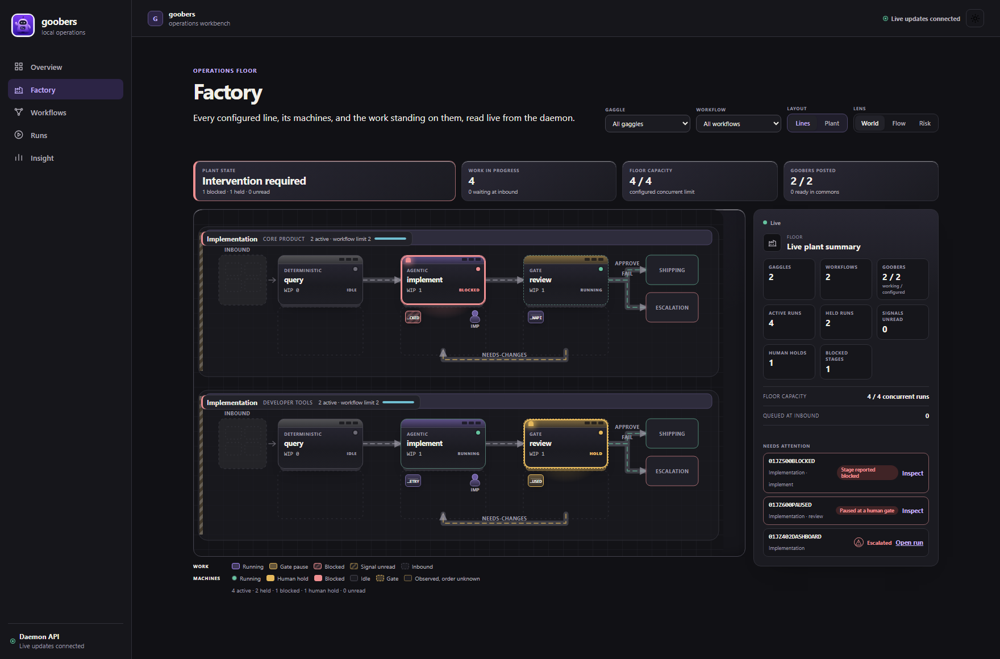
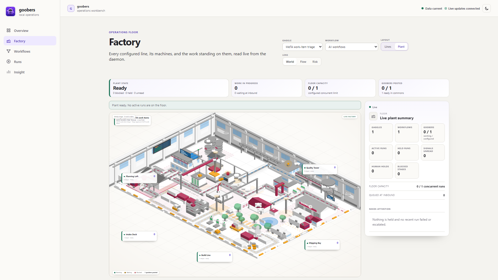

# Goobers

Upstream platform monorepo for **Goobers** — an open, self-hosted agent-workforce
platform. It starts as a single binary running a gaggle of AI agents against your
repo and backlog on one machine, and scales — without changing a definition — to
clustered orchestration over a large monorepo.

- **Architecture of record:** [`docs/ARCHITECTURE.md`](docs/ARCHITECTURE.md) — one
  system across three deployment tiers; local runner first, cloud (Temporal/AKS) as
  drop-ins behind named seams.
- **Concepts:** [`docs/concepts/`](docs/concepts/) — desired state, the config
  repository as source of truth, and the propose-via-PR trust model.
- **Product vision:** [`docs/VISION.md`](docs/VISION.md)
- **Requirements:** [`docs/requirements/`](docs/requirements/)
- **Roadmap:** GitHub milestones — **V0** "works locally, begins to build itself",
  **V1** arbitrary repos/teams/hardening, **V2** cloud scale.

## Repository layout

| Path | Contents | Status |
|---|---|---|
| `api/` | Definition types, JSON invocation/result/verdict envelopes, YAML schema | Active — extended by DSL v0 |
| `providers/` | Backlog + repo provider abstraction (GitHub / ADO) | Active — V0 workload |
| `cmd/goobers` | The product binary: `init`, `validate`, `up`, `run`, `status`, `trace` | Active — being built under V0 |
| `cmd/operator` | Kubernetes operator entrypoint | **Quarantined** — tier-3, revived in V2 |
| `cmd/scheduler` | Cluster scheduler process (Temporal-backed) | **Quarantined** — tier-3, revived in V2 |
| `cmd/goober-runtime` | Per-run agent pod runtime | **Superseded** — folds into `goobers`' local stage execution |
| `internal/operator` | Kubernetes operator reconcile logic | **Quarantined** — tier-3, revived in V2 |
| `internal/configsync` | Config-repo → CRD render/apply (ArgoCD bridge) | **Quarantined** — tier-3 (CRD-apply path), revived in V2 |
| `internal/` (other) | Shared Go packages (engine core, telemetry, app bootstrap) | Active |
| `infra/` | Bicep, ArgoCD, Temporal, ADX | **Quarantined** — tier-3 drop-ins, revived in V2 |
| `portal/` | TypeScript + React observability portal; operator co-brandable via `instance.yaml` | Active — retargets to run journals in V1 |
| `config-examples/` | Reference config layout + starter definitions | Active |
| `samples/` | Versioned, disposable onboarding targets | Active |
| `agent-toolkit/` | Release-owned bundle instructions and harness adapters | Active |
| `skills/` | Canonical portable skills used by the agent toolkit | Active |
| `test/` | CI + e2e harness | Active |

Quarantined paths stay in-tree, compiling, and status-bannered — they are the
documented tier-3 drop-in points (`docs/ARCHITECTURE.md §10`), not dead code.
See `docs/ARCHITECTURE.md §11` for the full disposition map.

## Factory Floor

Factory Floor is the portal's operations view. It is under active development. It maps
configured workflows, stages, active runs, and goobers into a live plant without
simulated work.

It offers two layouts over the same live model, chosen by a toggle on the page.
**Lines** is the precise topology: declared stages in graph order with every
edge, outcome, and terminal. **Plant** is the boss's-window overview: one
polished isometric factory with production-zone callouts, real stage machines,
work crates, alarms, and posted goobers. The complete plant scales to the
available viewport instead of becoming a scrollable map. Switching layout
changes only how the floor is drawn, never what is read.





See the [Factory Floor read-model design](docs/design/factory-floor.md) for data
sources, safe fields, failure behavior, the layout contract, and the proposed
future read endpoint.

## Go module

- Module path: `github.com/goobers/goobers`
- Minimum Go version: the toolchain declared in [`go.mod`](go.mod)

Import shared packages as e.g. `github.com/goobers/goobers/internal/version`.

## Binaries (`cmd/`)

The product binary is **`goobers`** — the local runner: `init`, `validate`, `up`
(daemon: scheduler + runner), `run`, `status`, `trace`. It is being built under the
V0 milestone; see the V0 epic issue for the work breakdown.

Pre-existing entrypoints (`operator`, `scheduler`, `goober-runtime`) are tier-3 /
superseded skeletons kept per the quarantine plan (`docs/ARCHITECTURE.md §11`).
Every binary shares `internal/app.Main`, which wires `--version`, structured logging
(`--log-level`, `--log-format`), and SIGINT/SIGTERM-aware shutdown.

## Quickstart (tier 1, local)

New to declarative control systems? Read
[How Goobers works](docs/concepts/README.md) first; it explains why `config/`
defines behavior while runs, workcopies, and scheduler records are runtime
state.

No tagged release exists yet, so build from source with the Go toolchain
declared in [`go.mod`](go.mod). The fastest first run is the hermetic demo:

```sh
make build   # or: go build -o bin/goobers ./cmd/goobers

bin/goobers init --demo ./demo-instance
bin/goobers run demo ./demo-instance
bin/goobers trace <run-id> ./demo-instance
```

The demo runs the full curate -> implement -> review -> merge-preview loop on
Linux or macOS with mock providers, no credentials, and no network writes. It
also shows how a run pauses at a gate before completing.

From there, graduate in this order:

1. Seed the disposable, token-bearing `quickstart@v1` path with
   `bin/goobers init --template=quickstart ./tutorial-instance`.
2. Scaffold a regular instance with `bin/goobers init ./my-instance` and run
   its starter workflow with
   `bin/goobers run default-implement ./my-instance`.
3. Adapt the production-oriented definitions under [`config-examples/`](config-examples/),
   which add review, CI, remediation, escalation, and merge-policy patterns.

The [full quickstart](docs/guides/quickstart.md) walks through that progression
and the remaining CLI surfaces.

For a regular instance, the core inspection and operator commands are:

```sh
bin/goobers config show ./my-instance    # effective config (secrets redacted)
bin/goobers run default-implement ./my-instance # trigger a run manually
bin/goobers status ./my-instance         # list runs + their phase
bin/goobers claims list ./my-instance    # inspect current claim leases
bin/goobers claims release --force <item-id> ./my-instance # override a live holder
# If an item ID is claimed in multiple namespaces, add:
#   --gaggle=<name> --provider=<name>
bin/goobers trace <run-id> ./my-instance # inspect one run's journal
bin/goobers escalations ./my-instance    # list escalated runs
bin/goobers escalations show <run-id> ./my-instance # inspect cause + artifacts
```

Once a tagged release exists, a checksummed installer script will let you
install an exact release without a source checkout; see
[Releases & packaging](docs/guides/releases.md#install-a-pinned-release) for
that (currently unreleased) path and its reproducibility details.
`goobers init --guided` is a first-run flow that separately selects the
configuration source and target application repository. It creates or reuses a
checked-in source tree (`instance.yaml.example`, `manifest.yaml`, and
`gaggles/`), then materializes the runtime instance described in
`docs/ARCHITECTURE.md §6` — `instance.yaml`, `config/`, `runs/`, `scheduler/`,
`workcopies/`, and `telemetry.db`. The flow can also detect local coding-agent
harnesses and, after an explicit harness and destination preview, install the
release-matched agent toolkit only in the selected config source. Skipping that
step writes no toolkit files. Populated source and instance destinations are
never overwritten. Set the referenced credential environment variables at runtime
and author the workforce in the selected configuration source; the instance
records that source in `workflowSource` while runtime state remains outside it.
After later source edits, stop the daemon and run
`goobers config materialize ./my-instance` before restarting; this validates
and reapplies the recorded desired state without touching runtime state. The
`quickstart@v1` template is intentionally limited to a
disposable first success and omits production remediation, escalation, CI, and
merge policy.
`goobers up` runs the daemon (embedded scheduler + local runner): it restarts
any run interrupted by a prior crash via `Runner.Resume`, then drives
scheduled workflows until interrupted, draining in-flight runs gracefully on
SIGINT/SIGTERM. `run` remains the way to trigger one workflow manually
without a daemon running. Platform-specific setup:
[Linux quickstart](docs/guides/quickstart-linux.md),
[Windows quickstart](docs/guides/quickstart-windows.md); run
the daemon as a supervised service via
[Daemon supervision](docs/guides/supervision.md)
(systemd · launchd · Windows Service). How binaries are built, packaged, and
verified for distribution: [Releases & packaging](docs/guides/releases.md).
Before making the daemon API reachable beyond loopback, follow the
[tier-2 OIDC authentication guide](docs/guides/oidc-authentication.md).
Azure DevOps instances can use
[Azure CLI, workload identity, managed identity, or PAT authentication](docs/guides/ado-authentication.md).
Operational workflows can query ADX or compiled organization adapters through
[external telemetry connectors](docs/guides/external-telemetry-connectors.md).

## Repository assistance with an agent

Each release publishes a portable
[Goobers agent toolkit](agent-toolkit/README.md) for an external coding agent
working in a config repository. Its canonical Agent Skills cover environment
resolution, [DSL authoring](skills/goobers-dsl-author/SKILL.md), read-only run
inspection, and workflow upgrades. Release-matched docs, schemas, examples, and
thin Copilot, Claude, and `AGENTS.md` adapters let it work without a source
checkout or running daemon. See the
[installation and usage guide](docs/guides/dsl-authoring-skill.md).

## Shell completion

Enable subcommand and flag completion, plus instance-aware workflow and recent
run ID completion, with the line for your shell (add it to the shell's startup
file to make it permanent):

```sh
source <(goobers completion bash)  # bash
source <(goobers completion zsh)   # zsh
goobers completion fish | source  # fish
goobers completion powershell | Out-String | Invoke-Expression  # PowerShell
```

## Developing

```sh
make verify-fast # pre-push format, vet, and Go build tier
make tidy-check  # check that go.mod/go.sum match tidy output
make ci          # merge gate (Go + config + portal)
make verify-full # merge plus integration, platform, and coverage gates
make vulncheck   # scan reachable Go code for known vulnerabilities
```

Portal builders can append `?portal-diagnostics=1` before the hash route (for
example, `http://localhost:5173/?portal-diagnostics=1#/runs`) to enable an
ephemeral `console.debug` stream with daemon request timing/status and the
initiating page, overlapping-request burst counts and elapsed time, and SSE
connect/disconnect/reconnect causes. This is default-off development tooling
for diagnosing the portal itself, not partner-facing workflow telemetry, and
it does not persist or send the events anywhere.

CI runs the same merge-tier implementation on every PR to `main`. See the
[`validation tier contract`](CONTRIBUTING.md#validation-tier-contract) for
audience guidance, CI job mapping, and per-platform prerequisites.

## Contributing

Goobers is open source and contributions are welcome. See
[`CONTRIBUTING.md`](CONTRIBUTING.md) for the workflow, [`SECURITY.md`](SECURITY.md)
for vulnerability disclosure, and the [Code of Conduct](CODE_OF_CONDUCT.md).

## License

Licensed under the [MIT License](LICENSE).
