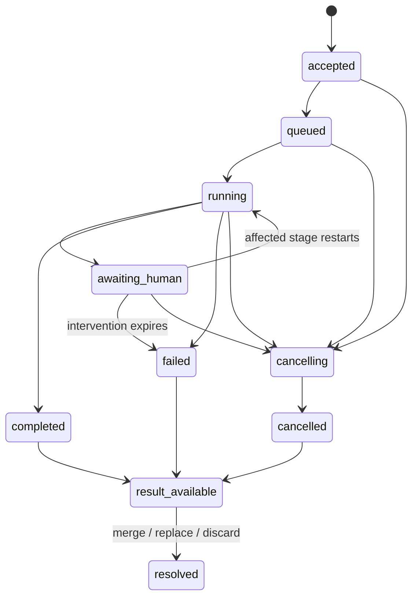

# Design: Agent-authored child workflows

> Status: draft — lifecycle contract and staged implementation plan
> Area: DSL, agent tools, execution, workspaces, journal, Portal
> Verified: 04198152b63d228a9714ae2f92a7dca079ba5213 (2026-10-03)

Program: [Human operations and advanced workflows](hitl-advanced-workflows-program.md).
Companions: `interactive-factory-operations.md`,
`gaggle-events-and-durable-start-queues.md`, and
`source-owned-backlog-workbench.md`. The generated design index links each as it
enters the review stack. Stable work IDs below do not require numbered issues.

## 1. User journey

An agent at an opted-in stage discovers work that needs a different composition
of existing Goobers. Using the installed DSL authoring skill, it writes a proposed
Workflow, validates it, and requests a child. Goobers durably accepts the proposal,
forks the parent's current workspace, and executes it through ordinary admission.
The parent waits. A blocked child appears in the operations portal, where a human
can provide guidance and restart the affected child stage. The originating parent
agent receives the result and chooses how to use the child changes. It can then
request another child or finish its own stage.

The generated graph is a separately identified run. The parent graph, definitions,
and previous attempts are not rewritten. Existing static parallel stages continue
to work: each executing branch may own one unfinished child of its own.

## 2. Decisions

- Opt-in belongs to an agentic task. Omission disables child tools.
- Generated documents may compose existing tasks, gates, parallel stages, Goobers,
  capabilities, and supported placement. They cannot introduce Goober definitions,
  new runtime images, new credentials, or novel capability implementations.
- Resolve all names from the parent's pinned gaggle configuration and immutable
  definition snapshot. Apply current revocations and placement availability again
  before execution; a snapshot does not preserve revoked authority.
- V1 permits one unfinished child per **stage occurrence**, not per workflow.
  A loop visit or parallel branch has its own occurrence identity. Sequential
  child requests from that occurrence get increasing invocation sequence numbers.
- V1 forbids recursive generation. A generated child cannot enable child tools;
  preserve recursion as explicit future scope, including depth and budget policy.
- Parent and child remain inside one gaggle. Cross-gaggle references are rejected.
- Canceling the parent requests cancellation of every unfinished descendant.
  Requested and confirmed cancellation are different observable states.
- The child workspace is forked from the parent's current tracked and permitted
  untracked work, including uncommitted edits. Child writes do not change the
  parent's workspace until the parent accepts a recorded disposition.
- Child PR publication is disabled unless explicitly granted by the parent at
  submission. A grant can only narrow the stage/gaggle publication policy.
- The parent can merge, replace its working state with the child result, or discard
  the child's workspace changes. Published PRs and external effects remain visible
  even when workspace changes are discarded.
- Durable waiting has separate timeout accounting from active agent execution.
  An idle parent stage process/pod is acceptable in v1 when the backend supports
  the wait contract and enough resources exist to run children.

## 3. Prior art and boundaries

[Copilot dynamic workflows](https://docs.github.com/en/copilot/concepts/agents/dynamic-workflows)
and [Claude Code workflows](https://code.claude.com/docs/en/workflows) describe
agent-generated programs that orchestrate agents and retain workflow progress.
They motivate a generated composition and durable result contract. Goobers uses
its own validated DSL and existing workload definitions as the execution boundary.
Harness-native orchestration can remain an internal agent technique; enabling it
does not confer native Goobers child identity, policy, workspace, or journal support.

[LangGraph durable execution](https://docs.langchain.com/oss/python/langgraph/durable-execution)
and [interrupts](https://docs.langchain.com/oss/python/langgraph/interrupts) motivate
stable invocation identity, persisted continuation inputs, and replay-safe effects.
Goobers must reconstruct a child wait from durable state rather than trust a live
MCP connection. None of these sources establishes provider write idempotence for us.

The existing [plan-driven map proposal](plan-driven-dynamic-fan-out.md) (#1310)
selects an immutable roster for a fixed task template. This proposal allows a
newly generated *separate workflow graph*. It neither replaces that map proposal
nor requires it. Related backlog requests #155 and #817 provide motivation;
existing artifacts, static fan-out, compiler, and runner placement are foundations.

## 4. Proposed author and agent contract

Spelling is proposed; validate it against the current evolvable DSL before adding
shipped examples. Frozen interpreters reject the extension with an actionable
version diagnostic. Register the preview capability and its actual supported
backends; a field accepted by a schema is not proof of executable support.

```yaml
# Fragment inside an agentic task in the evolvable DSL.
childWorkflows:
  allowedGoobers: [investigator, implementer, reviewer]
  allowedCapabilities: [repo:read]
  maxChildren: 4
  allowPRPublication: false
```

Capability identifiers come from the repository's canonical registry; the
example grants read-only repository access. Configuration validation rejects
unknown tokens and Goobers. Empty allowlists grant nothing. `maxChildren` is a
positive stage-occurrence limit, default 4, hard ceiling 32. Concurrent unfinished
children are fixed at one per occurrence in v1. Omitted `allowPRPublication` is
false. Budgets, repository targets, integrity floors, and runner placement continue
to intersect the enclosing policy; the allowlist alone is never a grant.

The harness receives a bounded, version-matched catalog of allowed existing
Goobers/capabilities and authoring guidance. Catalog entries describe supported
runner requirements without revealing credentials. Source/work-item text is
untrusted data; the compiler and admission service enforce authority.

Extend the existing agent-facing tool integration with typed operations:

| Operation | Required inputs | Result |
|---|---|---|
| `validate_child_workflow` | Workflow document/artifact reference, proposed grant | Bounded structured diagnostics; no execution |
| `start_child_workflow` | Idempotency key, proposal reference/digest, publication grant | Durable child receipt and lineage identity |
| `get_child_workflow` | Child ID owned by this occurrence | State, intervention, result/disposition references |
| `await_child_workflow` | Child ID, bounded transport wait | Current durable state or terminal result; safe to reconnect |
| `resolve_child_workspace` | Child ID, result digest, expected parent snapshot, merge/replace/discard | Durable reconciliation receipt/conflict details |

Transport waits are bounded even when the logical child wait has no deadline.
Cancellation/disconnection of a tool call does not erase accepted custody or
cancel the child implicitly. Server authentication binds run, stage occurrence,
attempt, gaggle, and capability; the agent cannot select a different parent by
editing request JSON. Expired attempts cannot start or reconcile new work.

Submission retries with identical identity and canonical content return the same
receipt. Reuse with changed content returns conflict. Editing a rejected proposal
requires a new request identity. Validation is advisory until atomic submission
repeats it against the pinned parent policy and acquires the occurrence's child
slot. A child cannot ask for more authority than the submitted grant.

## 5. Admission sequence

1. Bound input bytes before parsing: default/hard ceiling 1 MiB for a proposal,
   128 total tasks/gates/parallel states, and one Workflow document. Reject extra
   YAML documents and any new Goober/Gaggle resources.
2. Parse with closed schema, require explicit supported `dslVersion`, preserve
   original source and digest. Compile using the normal compiler, including
   references, contracts, feature status, integrity and placement constraints.
3. Require the canonical DSL's explicit-start declaration: exactly one
   `type: manual` trigger with no additional trigger fields. Reject background
   schedule/backlog/signal/webhook triggers, recursion, foreign gaggle/repository
   bindings, unknown Goobers/capabilities, and effects outside the parent grant.
   The parent is the only authorized starter; generated definitions never enter
   the configured workflow scheduler catalog. This keeps generated source valid
   under the ordinary schema without injecting synthetic trigger fields.
4. Evaluate effective permissions across task and Goober defaults, gates, tool
   surfaces, nested harness behavior, and deterministic commands. Publication
   denial must constrain actual credentials/egress/capability enforcement, not
   just scan the graph for a known PR stage name.
5. Resolve and pin existing runtime definitions and solve configured runner/pod
   requirements. Missing compatible placement yields diagnostics before a receipt;
   temporarily unavailable compatible capacity leaves an accepted child queued.
6. Freeze the parent workspace snapshot and verify its content digest. Exclude
   credentials, runtime control files, sockets, and configured ignored content.
   Snapshot metadata distinguishes an omitted file from a preserved deletion.
7. Atomically reserve invocation sequence, child ID, child slot, budget lineage,
   proposal/snapshot references, grant/policy digests, and durable start intent.
   Publishing this transaction is the acceptance boundary. A crash before it
   produces no child; a lost response after it can be replayed idempotently.
8. Execute through the same admission/queue/runner path as ordinary starts.
   Revalidate revocations and readiness. Do not start a second private scheduler.

Validation must also run at daemon admission and stage dispatch, not only in a
CLI helper. Availability and policy diagnostics identify the affected stage and
field without copying secrets or unrestricted generated prompts.

## 6. State, durable wait, and capacity



The parent's stage becomes `waiting_child` after acceptance. A durable occurrence
record points to child, start intent, last observed state, and continuation cursor.
A child terminal result is persisted before waking the parent. Delivering the same
result twice is harmless; advancing the parent continuation is a compare-and-swap
against that result identity. The one-child slot remains occupied until a workspace
disposition is confirmed (use discard for a result with no changes), so a live response lost after child completion cannot
accidentally create a second workstream with unresolved changes.

The existing journal may record failed/escalated execution before a live operator
window. Inspect authoritative control/intervention state; do not return terminal
failure to the parent while recovery is still allowed. Expiry settles the child
and closes its intervention. Parent Portal rows display why the child is waiting
and link to the exact actionable occurrence.

Current execution is pod-per-stage. Existing defaults include bounded harness,
Temporal activity, Kubernetes pod, and stall timers. A logical wait must be wired
through **all** of them. Zero in existing timeout fields often means default;
do not reinterpret every zero as unbounded. Introduce an explicit child-wait
policy with absent deadline meaning no child-wait deadline, plus operator-set
finite limits. Active execution budgets stop while waiting; elapsed wait is still
reported. Existing configured overall wall-clock deadlines remain explicit and
visible instead of being silently disabled.

A waiting stage occurrence releases its active execution permit while retaining
run identity, logical run accounting, budgets, and workspace lease. Track runnable
owners across parallel branches: one waiting branch must not release an entire
run permit while a sibling still executes. Existing run-level `ReleaseRun` alone
is insufficient; resume reacquires capacity before returning control to the agent. If the process/pod stays
alive, resource accounting still includes its memory/pod occupancy and child
admission must reserve a viable execution slot. Reject configurations that cannot
schedule a child behind a waiting parent; never bypass quota to break the deadlock.
Backends unable to suspend/reacquire a permit or extend the relevant timer must
refuse the feature until supported. Progress heartbeats must distinguish a healthy
wait from fabricated agent progress.

## 7. Restart, crash recovery, and cancellation

Persist lineage in the control store and mirror references into run journals and
read models. The initial daemon is the write authority; remote stage pods call it
instead of opening their own SQLite files. Recovery scans a bounded set of active
lineages and reconciles with accepted start intents and authoritative run state.
Use the existing triggerqueue recovery seam; uncertain dispatch is reconciled
against a stable assigned run ID before retry. Keep lineage separate from the
existing `SourceRun` priority-retick field. Parent-cancel fences and child
acceptance share the queue transaction; the existing separate cancellation
receipt database alone cannot make check-then-submit atomic. A durable cancellation
outbox then invokes ordinary run control and records confirmation.

Exact proposal source is retained as a content-addressed BLOB in that same queue
database, keyed by `(gaggle, sourceDigest)`. Acceptance commits its ownership
with the lineage and start receipt. The small start envelope contains digests
and pinned generation references, not inline source. Shared source is removed
when its final full lineage owner is tombstoned; missing or tampered accepted
source is a custody failure, never silently repaired from a retry.

The trusted stage launcher also binds the current signed grant to its occurrence
in this database. Acceptance checks the exact grant, attempt, config and policy
binding inside its transaction. Replacement and revocation use compare-and-swap;
an old attempt cannot race the live-authority check to start another child. A
current-policy change revokes affected grants before publishing changed runtime
authority. This binding contains no provider credentials.

- Daemon restart before dispatch: accepted child remains queued exactly once.
- Lost parent pod/session: child continues. A replacement attempt restores prior
  context and the pending/result reference, without regenerating/replaying child
  submission as a new action. Session reattachment is an optimization.
- Child stage loss: ordinary child recovery applies, with unchanged lineage.
- Parent cancellation racing acceptance: an atomic cancelled-parent fence prevents
  future admission; any accepted child is cancelled through ordinary run control.
- Parent cancellation racing completion: preserve whichever terminal child result
  was confirmed; mark parent cancellation and require no further agent continuation.
- Policy revocation: deny subsequent effects, record cause, and expose the blocked
  child/parent rather than impersonating the prior credential.
- User guidance on child: use the same intervention API and affected-stage restart
  contract as any run. Prior history stays; the recovery allowance is a new epoch.

The queue now distinguishes the fixed accepted child identity from its current
execution run. A human restart reserves one of eight bounded execution epochs by
comparing the exact source run, terminal journal sequence, retained result and
selected-guidance plan. Every epoch retains its own immutable result; the active
pointer changes atomically with the parent cancellation fence. An admitted
parent disposition or acknowledged slot prevents restart. Prior result references
cannot acknowledge or dispose the new epoch. Escalated sources must first have
verified stopped-writer result custody, even though the child awaits a human.

Epoch context is bounded to 4 MiB and result storage is reserved before admission
against the existing shared queue quota. The production child-family pruner
releases context/result bytes after acknowledged family settlement plus 30 days;
small execution identity tombstones survive the next 30 days. This queue/journal
foundation does not enable sealed-child restart by itself: the common human
restart adapter still needs execution, interactive credential, fork, observation
and recovery wiring before HAW-CHD-008 is complete.

Cancellation is idempotent and includes queued children, live child pods, claims,
workspace leases, and interventions. The portal says `cancellation requested`
until cleanup is confirmed. Pruners cannot remove control references still needed
for reconciliation or in-flight effects.

## 8. Workspace and result contract

Snapshot and fork use the existing repository artifact/handoff machinery where
possible. Capture parent base commit, current tree digest, permitted untracked
files, deletions, repository binding, and integrity. Child branches/worktrees have
unique IDs; no execution in the parent worktree. Multi-repository snapshots must
bind each repository independently; unsupported shapes fail before acceptance.

A terminal result includes child/run IDs, pinned definition and snapshot digests,
status/outcome, bounded scalar summary, typed artifact references, change-set/base
references, published PR references and provider receipts, usage, and intervention
history references. Large transcripts/diffs are artifacts, not inline tool JSON.
Validate result integrity before making it available to the parent.

| Choice | Behavior | Conflict/retry rule |
|---|---|---|
| Merge | Three-way apply child's result relative to its fork base | Require expected parent revision; return conflicts without partial silent apply |
| Replace | Adopt verified child working tree as parent working state | Explicit agent choice, preserve prior parent snapshot and history; no ref force-push |
| Discard | Keep parent working state, release child workspace when safe | Retain result/history and published-effect references |

Reconciliation is a durable action with its own idempotency key and expected
parent snapshot. Record intention before mutation, verify actual resulting tree,
and settle after confirmation. A retry inspects whether the intended tree already
exists. Changing the parent's tree while the child ran is a revision conflict,
not permission to overwrite it. Failed/cancelled children may expose a partial
snapshot only when verified and explicitly chosen by the parent.

PR publication may happen before the child completes. The parent upfront grant
specifies permitted repositories and publication mode within existing policy.
Discard never means delete a published PR, remote branch, issue edit, or comment.
Additional cleanup is a distinct policy-authorized action with its own receipt.

### Initial host publication capability

The first implementation supports the canonical deterministic commands
`[goobers, push-branch]` and `[goobers, open-pr]` against the admitted gaggle
repository and base branch. They require the corresponding declared capability,
policy action, parent publication grant and current authority. Flags, shell,
network/environment overrides and alternate destinations are refused. The host
resolves only the exact stage credential; every contained model process retains
a model-only ceiling even when its workflow has publication permission.

A branch snapshot includes verified imported working-tree edits and preserves
real repository ancestry. Private/excluded paths preserve their original
repository versions; publication does not change the managed HEAD or index.
The destination is the configured branch namespace plus `children/<child-run>`.
An existing branch without a retained effect intent is never adopted.

V1 retains one immutable branch snapshot and one immutable PR request per
accepted child. Changed content, target or PR text is an explicit conflict.
Publication intent and confirmed effect evidence occupy at most two bounded
rows (64 KiB intent and 16 KiB receipt each), reserve capacity before effects,
and are pruned with their child lineage. Unconfirmed effects pin the entire
family after acknowledgement/settlement and keep receipt capacity reserved;
late read-only confirmation may release that pin without changing child results.
Durable digest selectors distinguish
never-admitted work from missing/corrupt custody. Instance credential audit and
run observation/ref-touched records identify the exact parent/child stage.

A lost push reply is reconciled against the exact retained commit and remote
reference. A lost PR reply can confirm the same head/base PR; if none can be
observed, it remains uncertain and cannot issue another creation request. The
read-only reconciliation service can inspect an exact pending intent and confirm
its observed branch/PR after the child has settled or the parent was cancelled.
It changes neither the child result nor execution state; absent or changed
provider evidence remains actionable human attention. The human bridge checks
current `run.intervene` and `repository.read` together, constructs the observer
for the verified immutable repository target, and owns the command audit. It
never receives credentials or target overrides from authored intent bodies.

Follow-on **HAW-CHD-007-PUB-REVISIONS** adds bounded revisions of the same owned
branch/PR after review or repass. **HAW-CHD-007-PUB-RECOVERY** connects that
read-only reconciliation service to the operator command ledger and portal, and
adds explicit decisions when no provider effect can be observed. Neither permits
multiple PR destinations or replaces an unknown outcome with a fresh identity.

## 9. Bounds and operational evidence

Proposed v1 defaults: 4 accepted children per stage occurrence (maximum 32), one
unresolved child at a time, 1 MiB proposal, 128 states, 64 KiB inline result, and
existing repository-artifact size limits. Admission reserves against the same
budget lineage; descendants cannot multiply a parent's token/cost allowance.
An operator-authorized recovery epoch records additional allowance explicitly.

Reuse queue bounds and journal/artifact retention. Retain terminal lineage for
30 days by default, active lineages until settled, and idempotency tombstones for
30 days after the retained result expires. The root family remains pinned while
any member is active. Default 10,000 lineages per gaggle; the shared queue database uses the event
design's 20% byte maintenance reserve rather than a second reserve. Ordinary
start receipts remain pinned as long as retained child lineage needs them, even
when ordinary queue retention would otherwise expire them. New submissions fail
with actionable capacity details when unsettled work consumes the usable limit. No active wait is dropped to satisfy retention.
The production maintenance loop prunes in batches of at most 100 and reports
blocked retention. Snapshot/artifact bytes count toward the existing store quota;
capacity admission happens before claiming durable acceptance.
Occurrence authority rows have a separate 10,000-row per-gaggle ceiling within
the same database byte budget. Revoked rows prevent stale launcher callbacks
from renewing an old attempt. They are pruned after parent settlement plus
30 days, with unresolved family members preserving custody, under the same
100-work-unit maintenance batch. Credential expiry alone does not end a parent
wait or delete child custody.

Record proposal validation/admission, authority/grant digest, queued/running/wait
transitions, parent/child IDs, occurrence/attempt/sequence, author, usage, wait
age, cancellation, and workspace disposition. Redact secrets before persistence.
Portal projections show the parent-child graph and actionable leaf blocker, with
links to immutable evidence and source PRs. Metrics distinguish queued capacity
wait, human wait, healthy child wait, and failed reconciliation.

## 10. Implementation tasks and acceptance

| Stable ID | Slice | Acceptance evidence |
|---|---|---|
| HAW-CHD-001 | Opt-in API/schema/compiler and feature admission | Old workflows unchanged; deterministic/unsupported dialect/backend use refused; names, bounds, and policy validated through production compile/admission |
| HAW-CHD-002 | Pinned proposal validation and authority envelope | Generated resource limits, recursion/triggers/foreign targets rejected; all effective capabilities and placement checked; typed diagnostics |
| HAW-CHD-003 | Durable lineage and child start intent | One slot per occurrence, concurrent branch slots, idempotent same request, changed request conflict, crash/lost-response reconciliation, bounded pruner |
| HAW-CHD-004 | Current-work snapshot and separate execution | Uncommitted edits/deletions preserved, secrets/control files excluded, compatible runner used, parent tree unchanged |
| HAW-CHD-005 | Agent tool and durable continuation | Production harness can submit/await/get result; process loss resumes pending child; sequential children work; no duplicate execution |
| HAW-CHD-006 | Wait-aware execution and family cancellation | Local and distributed timer/permit conformance; no capacity deadlock; queued/running/human-wait cancellation races settle |
| HAW-CHD-007 | Results, publication grant, and workspace disposition | Denied publication cannot use hidden effect path; upfront allowed publication recorded; merge/replace/discard replay-safe and conflict-aware |
| HAW-CHD-008 | Portal lineage and child interventions | Parent shows actionable child; guidance recovers affected stage with new allowance; cancellation confirmation and wait ages visible |
| HAW-CHD-009 | End-to-end authoring and backend rollout | Parent generates valid DSL with shipped skill, child runs/blocks/recovers/returns, parent reconciles and completes on each enabled backend |

Implement in this order except isolated conformance/test scaffolding. Partial
branches are draft and explicitly list missing production paths. Policy-only or
journal-only slices do not establish the end-to-end child feature. Reuse shared
queue/intervention contracts without requiring the full event/backlog UX first.

## 11. Rollout and review points

Default disabled; enable only on opted-in tasks and a backend with demonstrated
support. Add a walking-skeleton example using existing Goobers, a forced child
intervention, and all three workspace choices in tests. Verify both supported
harnesses separately; a common tool protocol does not prove timer/sandbox parity.

Review proposed config spelling, default bounds, and exact timeout policy with
the team. They are implementation defaults, not unresolved user permission. Later
work includes recursive children with depth/budget/ancestry controls, multiple
concurrent children within one stage, generated runner/Goober definitions, and
cross-gaggle delegation. Native harness dynamic workflows remain independently
usable under existing harness policy.


### Sealed inspection and current-epoch observation

Read-only intervention inspection resolves the exact accepted child's retained
configuration and machine without constructing a Runner or reviving an obsolete
credential generation. Saving guidance and validating its source can therefore
inspect a superseded execution epoch; execution still requires current authority
through the human restart admission adapter. Startup binds the inspection callback
after the credential plane exists.

Child drain and cancellation follow the active execution epoch. Terminal callbacks
carry their actual run ID; a late original-epoch result cannot settle the current
child. Cancelling an accepted epoch before its journal exists records that epoch's
own cancelled result and leaves the original result intact. The original start
receipt remains attached to its original run. Generated-source recovery resolves
the sealed child before any ordinary workflow-catalog lookup.

Composed queue/runner tests cover superseded read-only inspection, late result
fencing, and cancellation before the replacement starts. Public human restart
admission is now installed through the common queued adapter described below. Publication
from later child epochs still needs explicit emitter identity support; an existing
publication intent keeps its original epoch identity.


### Delivered common human child restart admission

The daemon connects generated children to the same authenticated human restart
service used for ordinary affected-stage restarts. The adapter verifies selected
saved guidance, current human and parent policy, exact source terminal generation,
and contained execution support before accepting a new child epoch. It seals an
escalated source before creating the replacement. The accepted plan is pinned in
the existing child queue; a capacity refusal leaves that same epoch queued. Exact
retries reuse it, and changed content under its key refuses.

The normal child drain rechecks current authority and resumes that exact affected
stage using the common launch path, its prior inputs, fresh attempt/repass budget,
explicit human instructions and isolated epoch workspace. Parent capacity,
cancellation, child-policy and interactive credential leases cover execution and
writer shutdown. Cancelling the parent or revoking policy while queued prevents
new effects. Original journals and previous results remain immutable. The runtime
workspace binding is not serialized back into the pre-admission plan.

Composed tests exercise HumanService, real SQLite acceptance, queued capacity,
Runner continuation, fresh attempt/guidance, completion, escalation sealing,
revocation and parent cancellation. Later-epoch PR publication remains a separate
explicit emitter-identity change; the adapter does not bypass that restriction.
