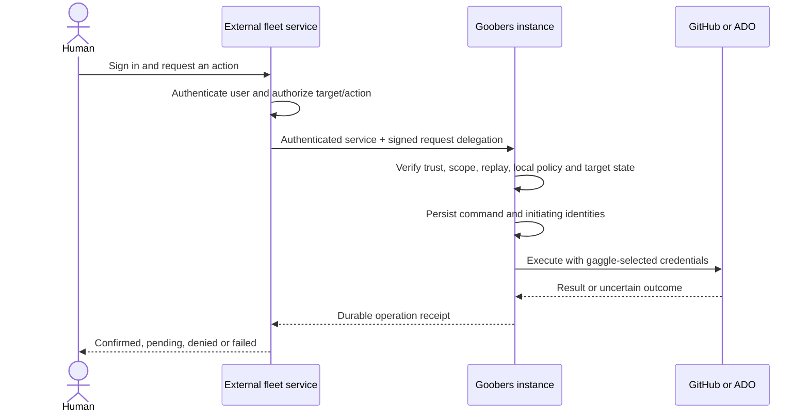

# Design: Fleet service authentication and delegated human access

> Status: draft — proposed contract; not implemented or live-qualified
> Area: fleet, authentication, authorization, HITL, audit
> Verified: fa34a754148ea3076bfd04fe4976a5a461b063f2 (2026-10-06)

Extends [fleet portal](fleet-portal.md) sections 5.2 and 7 and
[interactive factory operations](interactive-factory-operations.md) section 4.
Part of the [HITL program](hitl-advanced-workflows-program.md), with stable
`HAW-AUTH-*` task IDs pending numbered backlog items. This document defines the
fleet authentication addition; it does not claim to deliver the broader fleet
gateway, enrollment renewal, or browser sign-in.

## 1. Decision and scope

In fleet mode, an external service owns human sign-in, sessions, user membership,
and per-user permissions for each gaggle. It may use Entra ID or another identity
provider. An enrolled Goobers instance trusts that service to attest identity and
delegated permissions, within explicit local limits. Operators do not maintain a
duplicate human directory or repeat each fleet user grant in every gaggle YAML.

The instance owns the maximum actions/targets a gaggle exposes, its provider
credentials, PR policies, human-gate restrictions, and execution safety checks.
Fleet authorization never increases those limits. Each request targets one gaggle;
fleet-wide views aggregate independently authorized reads. No cross-gaggle event,
session, workflow, credential, or workspace authority is introduced.

Two human access modes are proposed:

- **Direct OIDC:** existing issuer validation and explicit local human grants.
  Browser sign-in remains a separate delivery requirement for direct portal use.
- **Fleet:** the external service handles browser authentication and calls the
  instance with authenticated service identity and signed delegation. Individual
  instances need no browser redirect registration or browser-held provider token.

V1 selects one human access mode per instance; omitted configuration preserves
existing behavior. Fleet mode never falls back to anonymous, direct OIDC, or
forwarded-header identity after failed delegation. Existing pod, worker, webhook,
and credential-plane authentication remain separate and cannot authenticate fleet
interactive requests. Changing modes is an explicit configuration operation.

## 2. Current foundation and missing work

| Existing code | Reuse and required extension |
| --- | --- |
| [OIDC verifier](../../internal/oidcauth/oidcauth.go) | Verifies issuer/audience/signature/time and maps roles. Add service-client identity validation; role mapping alone does not distinguish a human from an application. |
| [HTTP principal and authenticator](../../internal/httpapi/router.go) | Reuse the authentication seam. Add explicit service and delegated-human principal kinds and provenance. |
| [Interactive policy](../../internal/interactiveaccess/policy.go) | Reuse action/target checks. Replace the current human heuristic with typed identity; add an explicitly selected fleet-grant path. |
| [Credential selector](../../internal/interactiveaccess/credentials.go) | Keep exact server-owned bindings and per-effect checks; fleet supplies no provider credentials. |
| [Fleet protocol types](../../internal/fleet/types.go) and [connection signatures](../../internal/fleet/signature.go) | Enrollment/connection groundwork exists. Connection authentication is not delegated write authorization. |
| [Interactive access reference](../reference/interactive-access.md) | Existing local behavior remains the implementation reference until these tasks land. |

The implementation review snapshot does not contain this general delegated write
path. Existing fleet diagnostics/export authorization is also a separate contract.
See the [original OIDC seam design](v1/38-auth-oidc-seam.md), including its progress
correction, and the [fleet diagnostics reference](../guides/fleet-diagnostics-reference.md).
The existing fleet design was also checked against main at
`9a69b0997` on 2026-10-06 and is unchanged from the implementation baseline.
Before implementation, update the security, instance, deployment and portal
requirements to reflect the approved scope, as required by the fleet design.

## 3. Request flow and identity ownership



| Principal kind | Required evidence | Permitted use |
| --- | --- | --- |
| `human` | Direct-mode verified human access token and local grants | Existing direct interactive operations |
| `delegated-human` | Trusted service plus fleet-signed human identity, permission decision and request binding | Fleet interactive operations, subject to local human-gate checks |
| `service` | Trusted application identity plus fleet-signed service grant and request binding | Explicitly allowed background operations; never a human approval |

Record original human issuer plus stable subject, the acting service identity,
fleet ID, instance ID and gaggle separately. Display names are presentation only.
The fleet must derive these fields from its authenticated session, not browser
payloads. Group assertions used by human-gate rules must be separately verified
and namespaced by their original issuer; fleet roles do not imply group membership.
An approved fleet signer can attest these identities: compromise of that signer
can impersonate users within the local ceiling. Request binding limits reuse; it
does not remove that explicit trust relationship.

## 4. Service authentication and standards

V1 defines one delegation format with two deployment transports:

1. **Enrolled connection:** route through the authenticated fleet connection,
   bound to the pinned fleet ID and current registration generation. The connector
   must establish authenticated fleet-to-instance traffic before writes are enabled.
2. **Direct HTTPS:** the service obtains an OAuth application access token for
   the Goobers API and sends it in `Authorization: Bearer`. Validate issuer,
   audience, expiry, signature, application identity and explicit application
   permission, such as proposed `Goobers.Fleet.Invoke`. Tenant and client IDs are
   allowlisted; token validity alone is insufficient. Private routing is preferred.

Both transports require the same separately signed delegation. Direct HTTP uses
the proposed `Goobers-Delegation` header; connection frames carry an equivalent
field. The delegated actor must match the service authenticated by the transport.
Headers supplied by a browser or an untrusted reverse proxy establish no identity.
The fleet strips inbound delegation headers and creates its own. Neither token
is exposed to the browser, logged, or forwarded to GitHub/ADO.

For Entra, use a tenant-specific API registration and an assigned application
role. Prefer certificate or federated workload credentials for token acquisition;
managed identity is an option for a suitable Azure deployment. Register the exact
accepted issuer, audience and client identity claim mapping for the token version.
ID tokens and tokens intended for Microsoft Graph are not API access credentials.
[Client credentials](https://learn.microsoft.com/en-us/entra/identity-platform/v2-oauth2-client-creds-grant-flow)
authenticate an application; they carry no proof that a particular human acted.

Entra [On-Behalf-Of](https://learn.microsoft.com/en-us/entra/identity-platform/v2-oauth2-on-behalf-of-flow)
is an optional later adapter when the deployment can obtain the required delegated
API tokens. It does not replace local target checks or request binding. V1 fleet
delegation works without OBO, and does not implement an OAuth authorization server
or claim [RFC 8693](https://www.rfc-editor.org/info/rfc8693/)
interoperability. The standard's distinction between subject and
actor informs the identity model; the wire contract below is Goobers-specific.

## 5. Delegation contract, version 1

Use a signed JWT with explicit `typ: goobers-fleet-delegation+jwt`, version `1`,
and `kid`. V1 uses RS256 with an explicitly pinned verifier algorithm. The existing
ECDSA enrollment challenge key is a different key and protocol. No unsigned,
HMAC, token-directed `jku`/`x5u`, or arbitrary algorithm selection is accepted.
Fleet signing keys live in its server-side key store; instances hold public trust
configuration only. A reviewed future version may add algorithms.

| Required claim | Contract |
| --- | --- |
| `iss`, `fleet_id` | Exact configured fleet issuer and enrolled fleet ID |
| `aud`, `instance_id`, `registration_generation` | This instance's configured delegation audience, immutable instance ID and current enrollment generation |
| `sub`, `principal_kind` | Stable subject in the fleet issuer namespace; `delegated-human` or `service` only |
| `human` | For delegated humans: original issuer/subject, session reference and authentication time; optional verified group IDs. Forbidden for app-only service grants |
| `act` | Acting service issuer and stable subject/client ID, matching the authenticated connection/application |
| `gaggle`, `action`, `target` | One exact gaggle, registered action, and typed target including run/stage/occurrence or provider/repository/item as applicable |
| `request` | Method, registered route ID, exact instance-relative path/query and SHA-256 of the body bytes; writes also bind the idempotency key |
| `decision_id`, `policy_revision` | Fleet's authorization decision reference and policy revision for audit and revalidation |
| `iat`, `nbf`, `exp`, `jti` | Bounded validity and unique cryptographically random identifier |

Default and maximum delegation lifetime is 120 seconds; allow at most 30 seconds
clock skew. Enforce `exp - iat`, future-issued tokens, duplicate claim keys, required
fields, bounded strings/collections and a 16 KiB encoded delegation limit. Limit
human groups to 128; excess or malformed groups are refused when asserted. Unknown
versions, principal kinds, actions and capability wildcards are refused.

Request binding happens after removal of a fixed, configured fleet routing prefix,
before any discretionary rewriting. Fleet and daemon hash the exact uncompressed
body bytes, including an empty body for GET. Reuse existing endpoint body limits;
compressed bodies are not accepted on this v1 surface. Reject dot segments, encoded
path separators, duplicate query keys and ambiguous encodings before authorization.
Fixture vectors define accepted URL encoding. Transport frame and HTTP adapters
must produce identical normalized requests, without accepting a browser-selected
upstream URL. Any mismatch fails before a handler or provider call.

An authorization endpoint is proposed on the external service, not the instance:
`POST /api/v1/delegations:authorize`. Authenticated browsers use their fleet session;
instance revalidation uses a separate authenticated service contract. Both return
a decision tied to the exact requested scope. This path and JWT claims are proposed
API additions, not currently callable endpoints.

## 6. Gaggle policy and configuration

The following is **proposed syntax**, requiring schema/validator changes; it must
not be copied into current deployed configuration as if already supported.

```yaml
# instance.yaml (illustrative values)
api:
  auth:
    mode: fleet
    fleet:
      associationRef: enrolled-fleet
      delegationIssuer: https://fleet.example.com
      delegationAudience: urn:goobers:instance:instance-123
      jwksUri: https://fleet.example.com/.well-known/jwks.json
      allowedServiceSubjects: [fleet-gateway]
      transport: enrolled-connection
      maxDelegationSeconds: 120
      authorizationLeaseSeconds: 30

# Gaggle spec (existing credentials bindings still required)
spec:
  interactiveAccess:
    authorization:
      mode: fleet
      fleetRef: enrolled-fleet
      delegatedActions: [backlog.read, backlog.edit, run.intervene, run.restartStage]
      serviceActions: [backlog.read]
    actions: [backlog.read, backlog.edit, run.intervene, run.restartStage]
    credentials:
      backlog: team-backlog-operator
      repositories:
        - repository: {provider: github, owner: acme, name: web}
          credentialRef: team-code-author
    sourceWrites: {mode: pull-request}
```

Direct HTTPS additionally configures the service-token issuer, audience, required
application role and allowed client IDs. These are independent from delegation
signing trust. `associationRef` identifies an existing enrollment, not an arbitrary
URL that silently enrolls an instance. Trust changes require local administration;
delegated callers cannot edit their own trust or capability ceiling.

Effective authority is the intersection of authenticated service grants, the signed
fleet decision, the instance trust ceiling, the gaggle action/target ceiling,
operation-specific constraints, and provider permissions. No per-user local grant
is required in explicit fleet mode. Direct mode continues to require those grants;
mixed human/fleet grant configuration is rejected in v1 to avoid ambiguous unions.

`serviceActions` defaults empty and must be a subset of locally allowed actions.
Background reads, selected backlog maintenance and explicitly granted restarts can
be service operations. Human-gate approve/override and an action defined as requiring
human confirmation always require a delegated-human principal and the existing
approver/occurrence checks. Split suboperations of broad `run.intervene` explicitly;
granting that action must never turn an app-only call into human approval.

Missing fleet authorization on a gaggle disables this new surface for that gaggle.
Existing monitoring policy does not grant fleet provider-backed reads. Provider
identity and credentials remain the existing explicitly selected gaggle bindings;
omission never falls back to the fleet service identity or another repository.

## 7. Replay, retries, revocation and outages

Persist replay admission keyed by fleet/registration generation/`jti`, atomically
with the command receipt for writes. Reads also reserve a bounded replay record
before dispatch. Consumed delegation IDs cannot authorize another execution.
A retry obtains a new delegation and reuses the original command idempotency key.
Only a currently authorized matching actor/target/request may retrieve the existing
receipt; the same key with a different payload returns a conflict.

Retain replay IDs through expiry plus skew; a registered startup and periodic
pruner removes expired entries. Initial hard cap: 100,000 active IDs per instance,
with per-service admission rate limits. At capacity, reject new work with a bounded
retry response; never evict an unexpired ID to make room. Existing operation receipt
retention remains separate: expiring a token cannot erase an operation's evidence.

Fleet membership changes may leave an issued delegation usable for up to its
120-second lifetime plus skew. New effect authorization uses a decision lease of
at most 30 seconds, bounded by token expiry for initial requests. Revalidation asks
the fleet for a new signed decision for the same actor, command and exact scope;
it must not replay the original human bearer token. Received local revocation is
applied before the next effect; fleet policy revocation is bounded by the decision
lease plus skew, not claimed instantaneous. Fleet-side session invalidation must
invalidate associated command authorization as well.

Persist revocations/policy generations and registration generation across restarts.
If no fresh decision can be obtained, pause before new writes or further sensitive
reads. Already submitted effects are reconciled and reported; they are not described
as rolled back. Receipt reads also require current read permission. Automatic
workflows with independent automation authority continue during fleet outages.

Pin the JWKS location in local trust configuration. Cache keys for at most five
minutes, bound refresh rate/time/size, and refuse expired caches if refresh fails.
Rotation overlaps keys through the last issued token's lifetime. Emergency trust
revocation and local key denylisting override cached keys immediately when applied.
Unknown keys trigger one bounded refresh, not token-controlled network discovery.

## 8. Queued work, agent sessions and human decisions

Persist a typed authority record alongside each accepted durable command: original
human/service identities, session reference, trust and policy generations, command
digest, admitted action/target ceiling, fleet decision ID and local credential refs.
Keep bearer/delegation tokens out of journals, model context and Temporal history.
Token expiration does not erase the command or cancel already accepted work by itself.

At dispatch, recovery, each session turn, and before provider effects, obtain a fresh
authorization lease for the retained command, then intersect it with current local
policy. Renewal cannot change the actor or widen accepted scope. Long work can
continue after the browser disconnects while the fleet retains the command grant;
session invalidation or permission removal blocks renewal. There is no blanket
service grant that lets the worker continue impersonating a departed user.

Lease enforcement must reach the executor: remote workers and provider brokers
refuse new effects after their lease expires. A running subprocess that cannot
enforce this bound must be stopped and its effects reconciled; that execution
shape cannot advertise fleet writes until the boundary is qualified. Revocation
cannot recall a request already accepted by GitHub/ADO. Stop accepting new effects,
retain uncertain receipts and use a separately limited reconciliation capability.

Each contributor to a shared session submits a newly authorized message. A session
creator's grant does not authorize subsequent users. Generated children retain the
originating authority ceiling; no child can replace it with fleet service authority.
Human-gate confirmation binds the exact occurrence and action digest. A renewed
execution lease preserves that recorded decision; it does not fabricate a new one.

## 9. Audit, portal behavior and operations

Record fleet/service identity, original human identity where present, command and
decision IDs, target gaggle, action, admitted/current policy revisions, provider
credential reference, and confirmed/uncertain outcome. Avoid logging raw tokens,
group lists, request bodies or secrets merely to diagnose authentication failures.
Cache provider projections by effective credential visibility and gaggle as today;
fleet membership changes must not reveal another user's broader cached response.

The portal displays the acting human or service, and distinguishes authorization
denied, authorization temporarily unavailable, queued, executing and effect unknown.
Unauthenticated requests return 401; scope denials return 403 without target
enumeration; conflicting retries return 409; exhausted replay admission returns
429; unavailable authorization dependencies return 503. Errors contain correlation
IDs, not token contents. Missing delegated capability never looks like a working
write control. SSE/WebSocket connections reauthorize within the same lease bound;
reconnect requires a fresh delegation and current resource permissions.

Fleet mode owns login/logout and CSRF/session protection at the external service.
Cookies used by that service must not become implicit authentication on the instance.
No instance browser sign-in UI is required for fleet-only deployments. Direct-mode
browser login remains a separate prerequisite, not supplied by this design.

Operational records (replay entries, command authority, enrollment/revocation state)
are durable Goobers state with versioned schemas and bounded retention. User
directories and strategic objectives remain external/source-owned. On rollback,
an older binary must reject unknown auth mode/authority versions, not downgrade to
local trust. Trust removal pauses affected delegated work; a local administrator
can cancel it through the existing explicitly authenticated administration path.

## 10. Delivery slices and acceptance

These are auth prerequisites within HITL, not a fifth independent product stream.
Implement after shared identity/queue foundations and before advertising fleet
write operations. Pure service auth alone is not sufficient to enable HITL writes.

| Task | Deliverable and required evidence |
| --- | --- |
| HAW-AUTH-001 | Approve trust/mode model; amend security/instance/portal/deployment requirements, configuration schemas and route/action taxonomy. Test omitted config, direct-mode compatibility and forbidden mixed modes. |
| HAW-AUTH-002 | Typed human/service/delegated principal and service auth adapter. Reject app-only tokens at human gates, wrong tenant/client/audience, ID tokens and forged group/actor headers. No implicit administrator grant. |
| HAW-AUTH-003 | Delegation signer/verifier reference fixtures, pinned key rotation and both transport adapters. Test body/path/actor/gaggle substitution, expiry/skew, algorithm confusion, malformed/oversized tokens and connection generation changes. |
| HAW-AUTH-004 | Durable replay and idempotent admission. Crash/restart, duplicate concurrent requests, changed retry payload, capacity exhaustion and registered expiry pruning must prove bounded state and no duplicate effect. |
| HAW-AUTH-005 | Fleet policy-to-gaggle ceiling adapter and command authorization lease protocol. Prove no duplicate user directory, service action restrictions, policy narrowing, credential separation and outage denial. |
| HAW-AUTH-006 | Queue/session/restart/child authority propagation and worker effect enforcement. Test revoked human during queue wait, session handoff, daemon/worker restart, expired lease during a tool call and uncertain provider effects. Unsupported executors remain disabled. |
| HAW-AUTH-007 | Audit, capability discovery, portal states, stream reauthorization, operator setup/rotation/rollback docs and secret scrubbing. Record human plus service on every tested mutation. |
| HAW-AUTH-008 | End-to-end fleet qualification with an external reference gateway and Entra application credentials; human, background service, two-gaggle isolation, key rotation, revocation and outage scenarios. Run provider fakes plus an explicitly documented live qualification. |
| HAW-AUTH-009 | Direct-mode browser sign-in tracked separately: login/callback/session/token lifecycle and end-to-end human access. Not a dependency for fleet-only deployments. |

Implementation PRs must install production callers for renewal/pruning/revocation,
not just interfaces and unit tests. Required review evidence includes a protocol
fixture pack usable by an independently implemented external service. Run the
same authorization vectors against supported local/Temporal execution shapes;
unqualified shapes report unavailable, never silently use automation credentials.

## 11. Deferred extensions and review choices

V1 uses one fleet per instance, one acting service per delegation, exact gaggle
scope, bounded validity, explicit service actions and server-owned write credentials.
Nested delegation, cross-fleet trust, arbitrary OAuth token exchange, OBO adapters,
customer-provided signing algorithms and simultaneous direct/fleet human mode are
future extensions. Broader fleet groups and routing remain owned by the fleet design.

Review the proposed 120-second delegation and 30-second decision lease defaults
against expected effect volume and revocation needs. Prefer signed lease reuse
within the bound to a directory lookup per tool call. Confirm the first external
gateway's transport and identity provider during implementation planning; this
document does not assume that service already implements the proposed protocol.
