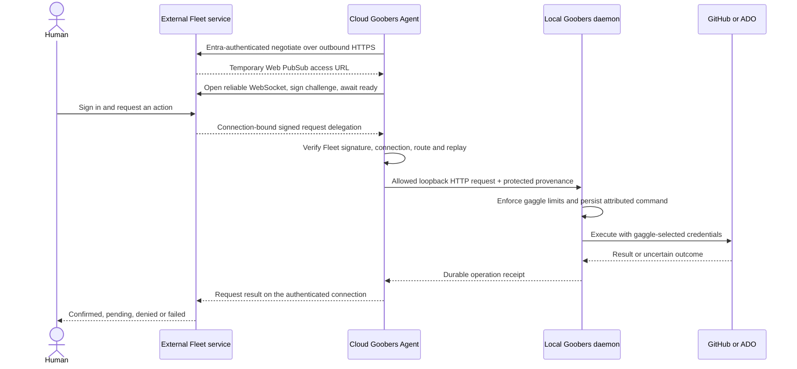

# Design: Fleet service authentication and delegated human access

> Status: draft — HITL extension aligned to the supplied production Fleet contract; not live-qualified here
> Area: fleet, authentication, authorization, HITL, audit
> Verified: fa34a754148ea3076bfd04fe4976a5a461b063f2 (2026-10-06)

Extends [fleet portal](fleet-portal.md) sections 5.2 and 7 and
[interactive factory operations](interactive-factory-operations.md) section 4.
Part of the [HITL program](hitl-advanced-workflows-program.md), with stable
`HAW-AUTH-*` task IDs pending numbered backlog items. This document defines the
fleet authentication addition; it does not claim to deliver the broader fleet
gateway, enrollment renewal, or browser sign-in.

## 1. Decision and scope

In fleet mode, an external service owns human sign-in, sessions, user membership,
and per-user permissions for each gaggle. The production Fleet contract supplied
by the project owner on 2026-10-06 uses Microsoft Entra delegated identity for
Agent enrollment and runtime. Other providers and workload identities are future
explicit integrations. An enrolled Goobers instance trusts Fleet to attest identity and
delegated permissions, within explicit local limits. Operators do not maintain a
duplicate human directory or repeat each fleet user grant in every gaggle YAML.

The instance owns the maximum actions/targets a gaggle exposes, its provider
credentials, PR policies, human-gate restrictions, and execution safety checks.
Fleet authorization never increases those limits. Each request targets one gaggle;
fleet-wide views aggregate independently authorized reads. No cross-gaggle event,
session, workflow, credential, or workspace authority is introduced.

Two human access modes are proposed:

- **Direct OIDC:** existing issuer validation and explicit local human grants.
  Browser sign-in remains a separate delivery requirement for direct portal use.
- **Fleet:** the external service handles browser authentication and calls the
  Agent over its outbound authenticated connection with signed delegation. The Agent
  forwards allowed requests to a daemon in the same host/pod network namespace.
  Individual daemons need no browser redirect registration or public Fleet listener.

V1 selects one human access mode per instance; omitted configuration preserves
existing behavior. Fleet mode never falls back to anonymous, direct OIDC, or
forwarded-header identity after failed delegation. Existing pod, worker, webhook,
and credential-plane authentication remain separate and cannot authenticate fleet
interactive requests. Changing modes is an explicit configuration operation.

## 2. Current foundation and missing work

| Existing code | Reuse and required extension |
| --- | --- |
| [OIDC verifier](../../internal/oidcauth/oidcauth.go) | Verifies issuer/audience/signature/time and maps roles. Add service-client identity validation; role mapping alone does not distinguish a human from an application. |
| [HTTP principal and authenticator](../../internal/httpapi/router.go) | Reuse the authentication seam. Add explicit service and delegated-human principal kinds and provenance. |
| [Interactive policy](../../internal/interactiveaccess/policy.go) | Reuse action/target checks. Replace the current human heuristic with typed identity; add an explicitly selected fleet-grant path. |
| [Credential selector](../../internal/interactiveaccess/credentials.go) | Keep exact server-owned bindings and per-effect checks; fleet supplies no provider credentials. |
| [Fleet protocol types](../../internal/fleet/types.go) and [connection signatures](../../internal/fleet/signature.go) | Enrollment/connection groundwork exists. Connection authentication is not delegated write authorization. |
| [Interactive access reference](../reference/interactive-access.md) | Existing local behavior remains the implementation reference until these tasks land. |

The owner-supplied production Fleet/Agent contract in section 4 is the integration
baseline, not evidence of a live test performed in this review. The older in-repo
connector types are not a substitute for that v2 contract. The implementation
review snapshot does not contain the proposed general HITL delegated write adapter. Existing fleet diagnostics/export authorization is also a separate contract.
See the [original OIDC seam design](v1/38-auth-oidc-seam.md), including its progress
correction, and the [fleet diagnostics reference](../guides/fleet-diagnostics-reference.md).
The existing fleet design was also checked against main at
`9a69b0997` on 2026-10-06 and is unchanged from the implementation baseline.
Before implementation, update the security, instance, deployment and portal
requirements to reflect the approved scope, as required by the fleet design.

## 3. Request flow and identity ownership



| Principal kind | Required evidence | Permitted use |
| --- | --- | --- |
| `human` | Direct-mode verified human access token and local grants | Existing direct interactive operations |
| `delegated-human` | Trusted service plus fleet-signed human identity, permission decision and request binding | Fleet interactive operations, subject to local human-gate checks |
| `service` (future opt-in) | Explicitly supported Fleet service grant plus signed request binding | Background operations only after qualification; never a human approval or an enrollment substitute |

Distinguish four identities: the Entra identity enrolling/running the Agent, the
local P-256 Agent registration identity, the Fleet signer/acting service, and the
human initiating a specific action. The runtime Entra bearer does not prove that
the enrolling user initiated every forwarded request.

Record original human issuer plus stable subject, the acting service identity,
fleet ID, instance ID and gaggle separately. Display names are presentation only.
The fleet must derive these fields from its authenticated session, not browser
payloads. Group assertions used by human-gate rules must be separately verified
and namespaced by their original issuer; fleet roles do not imply group membership.
An approved fleet signer can attest these identities: compromise of that signer
can impersonate users within the local ceiling. Request binding limits reuse; it
does not remove that explicit trust relationship.

## 4. Production Fleet/Agent integration baseline

This section records the project owner's supplied production contract. Preserve
the existing protocol's wire schema, signing algorithm and frame definitions;
the previous draft's direct inbound HTTPS option and invented JWT profile are
withdrawn. Proposed HITL additions are identified separately below.

### 4.1 Network and local daemon

- The cloud Agent initiates all Fleet network connections. Permit outbound TCP
  443 to the configured Fleet HTTPS origin, Microsoft Entra endpoints and the
  `wss://` Azure Web PubSub access URL returned by authenticated Fleet negotiation.
- Do not expose an inbound Fleet port. The Agent forwards to literal loopback
  HTTP, default `http://127.0.0.1:8085`, in the shared host/pod network namespace.
  Do not publish that port publicly or replace it with a service/ingress address.
- Permit the Fleet-returned Web PubSub destination through egress policy; reject
  non-`wss` URLs and unapproved endpoints. Its credential-bearing access URL is
  secret and must not appear in logs or durable run records.
- This is the Fleet control path's egress contract. Independently configured
  provider/model execution may require its own explicit outbound destinations.

### 4.2 One-time enrollment and protected state

1. Discover configuration at `GET /.well-known/goobers-fleet` on the chosen Fleet
   HTTPS origin and verify the intended Fleet identity.
2. Authenticate the enrolling user with Entra using the supported delegated flow.
3. Generate the Agent's local P-256 keypair and prove possession of its private
   key during registration using Fleet's registration/challenge protocol.
4. Persist registration identifiers, Fleet signing public key, Agent private key
   and authentication state in protected durable storage. Use the supported
   protected token cache; keep private keys and refresh material out of images,
   repository configuration, logs, model context and journals.

Restart or reconnection reuses this registration; it does not enroll again. A
replacement Agent must not silently share a live Agent's registration/keypair.
Existing fencing handles concurrent attempts, and replacement/recovery must be
explicit. Authentication expiry or required user interaction must surface as
unavailable/re-authentication-required, not trigger credential substitution.

Production enrollment and runtime currently use delegated Entra identity. A
headless service requires an explicitly supported workload-identity enrollment
and runtime flow with Fleet-side permissions, registration binding, credential
renewal and tests. An arbitrary client secret, managed identity or service token
cannot be substituted into the current user flow. OAuth
[client credentials](https://learn.microsoft.com/en-us/entra/identity-platform/v2-oauth2-client-creds-grant-flow)
is a possible future integration building block, not evidence of current support.

### 4.3 Runtime connection and presence

1. Obtain the supported Entra bearer token and call
   `POST /api/fleet/v2/agents/{instanceId}/negotiate` over HTTPS.
2. Use the returned temporary Web PubSub `wss://` access URL, currently valid
   for up to one hour, to open the reliable WebSocket.
3. Receive Fleet's challenge, sign it with the registered P-256 private key,
   and wait for `ready`. Dispatch no Fleet requests before that state.
4. Keep the connection alive using the Web PubSub reliable protocol and its
   acknowledgement/reconnect/resume behavior.
5. After handshake, send Entra-authenticated
   `POST /api/fleet/v2/agents/{instanceId}/presence` every 30 seconds.
   Fleet expires presence after 90 seconds. Transport keepalives and presence
   are separate obligations; neither is evidence that a requested operation ended.

If resume produces a different transport connection, discard the old session,
negotiate again, complete a new signed challenge and await `ready`. Do not carry
old connection authority into the replacement. Application handlers retain
request-idempotency evidence so reliable redelivery cannot duplicate an effect.

| Fleet control response | Required Agent behavior |
| --- | --- |
| `401`, `403`, `404` | End the current session, stop accepting work on it, and report the authentication/permission/registration failure. Recovery requires a valid supported state, not a fallback identity. |
| `409` | Treat the connection as superseded, discard its authority, and re-establish through negotiate/challenge/ready. |
| Transient disconnect | Use bounded reconnect/resume; preserve authority only if the reliable protocol retains the exact authenticated connection. |
| Revocation/fence | End that session's authority; any replacement must pass current Fleet authorization and registration checks. |

The one-hour access URL, 30-second presence cadence, 90-second presence expiry,
per-request delegation expiry and proposed HITL authorization leases are distinct
clocks. A live socket or presence heartbeat never extends delegation authority.

### 4.4 Agent-to-daemon trust boundary

The Agent verifies each Fleet delegation before forwarding an allowlisted route
to loopback. For the new HITL surface, a proposed daemon adapter must preserve
the verified user/service provenance and command scope through an authenticated
local Agent-to-daemon mechanism. It must not accept arbitrary forwarded identity
headers merely because a request came from loopback. Shared network namespace is
a connectivity requirement, not proof of a particular local process's identity.

Define the local proof and its installation/rotation together with the adapter:
either pass Fleet-verifiable evidence plus protected current-connection state, or
use a narrowly scoped local Agent credential and integrity-protected provenance.
Choose and qualify one before enabling HITL routes. The local credential must
grant only the registered forwarding surface, not generic daemon administration.
Strip caller-supplied provenance, never forward the Entra bearer or Web PubSub
access token, and reject redirects or arbitrary upstream URLs. Provider credentials
stay with the daemon's gaggle bindings. This adapter is proposed work, not a claim
about how the production Agent currently implements every loopback route.

## 5. Existing delegation and proposed HITL extensions

Fleet requests already contain a Fleet-signed delegation bound to the instance,
registration, exact connection, route, request ID, expiry and replay protections.
The Agent verifies it using the Fleet signing public key retained at enrollment
before forwarding. Implement against production-compatible fixtures; do not infer
the delegation's signing algorithm from the Agent's P-256 keypair or invent a
replacement JWT `typ`, claim vocabulary, JWKS endpoint or issuer/audience format.

The HITL adapter requires the following logical bindings. Some extend the existing
contract and must be negotiated/versioned with Fleet; names here are logical
requirements, not claims about deployed JSON field names.

| Binding | HITL requirement |
| --- | --- |
| Fleet, instance, registration, exact connection | Match the pinned Fleet and active ready session; any old connection or registration is refused |
| Route and request ID | Bind the allowed method/path/query and request identity before dispatch |
| Expiry and replay identity | Verify signature/time and consume or reconcile request identity without repeating effects |
| Principal kind and acting service | Distinguish delegated-human requests from any future supported service actions |
| Original human | Verified issuer/subject, session reference and relevant authentication evidence, independent of Agent enrollment identity |
| Gaggle, action and typed target | Exact locally configured gaggle, action and run/stage/occurrence or provider/repository/item |
| Mutation contents and idempotency key | Integrity-bind body bytes and command identity, so an approved request cannot be changed or executed twice |
| Decision and policy revision | Retain Fleet authorization evidence and an exact command scope for later revalidation |

Preserve deployed expiry semantics. Proposed HITL defaults, subject to Fleet
compatibility review, are a maximum 120-second delegation lifetime, 30 seconds of
clock skew and a 16 KiB delegation limit. Bound fields and verified group lists;
reject malformed claims, unknown versions/actions, wildcards and algorithm
downgrades. These are not the Web PubSub access URL's lifetime or presence limits.

The Agent and daemon adapter must agree on route normalization and exact body
integrity. Reuse endpoint body limits; proposed v1 HITL forwarding rejects compressed
bodies, duplicate query keys, encoded path separators and ambiguous rewrites.
Compatibility fixtures must cover byte encodings before tightening existing routes.
Requests never select an upstream host: allowed targets resolve only to configured
literal loopback and allowlisted daemon routes.

No new `/api/v1/delegations:authorize` endpoint is assumed. Command reauthorization
is proposed protocol work to agree with Fleet over its authenticated control
channel or a documented Fleet HTTPS endpoint. Entra
[On-Behalf-Of](https://learn.microsoft.com/en-us/entra/identity-platform/v2-oauth2-on-behalf-of-flow)
and [OAuth token exchange](https://www.rfc-editor.org/info/rfc8693/) may inform
future adapters; neither replaces the production registration/connection handshake
or proves that app-only enrollment is supported today.

## 6. Gaggle policy and configuration

The following is **proposed syntax**, requiring schema/validator changes; it must
not be copied into current deployed configuration as if already supported.

```yaml
# instance.yaml (illustrative values)
api:
  auth:
    mode: fleet
    fleet:
      associationRef: enrolled-fleet
      transport: agent-loopback
      daemonEndpoint: http://127.0.0.1:8085
      # Registration and Fleet public trust come from protected enrollment state.
      maxDelegationSeconds: 120
      authorizationLeaseSeconds: 30

# Gaggle spec (existing credentials bindings still required)
spec:
  interactiveAccess:
    authorization:
      mode: fleet
      fleetRef: enrolled-fleet
      delegatedActions: [backlog.read, backlog.edit, run.intervene, run.restartStage]
      serviceActions: [] # Disabled until a supported service flow is qualified.
    actions: [backlog.read, backlog.edit, run.intervene, run.restartStage]
    credentials:
      backlog: team-backlog-operator
      repositories:
        - repository: {provider: github, owner: acme, name: web}
          credentialRef: team-code-author
    sourceWrites: {mode: pull-request}
```

`associationRef` identifies protected existing enrollment, not an arbitrary URL
that silently enrolls an instance. This example adds no inbound Fleet endpoint.
The Agent owns its Entra authentication state and negotiated connection; the daemon
accepts only the protected local forwarding adapter. Trust changes require local
administration; delegated callers cannot edit their own trust or capability ceiling.

Effective authority is the intersection of authenticated service grants, the signed
fleet decision, the instance trust ceiling, the gaggle action/target ceiling,
operation-specific constraints, and provider permissions. No per-user local grant
is required in explicit fleet mode. Direct mode continues to require those grants;
mixed human/fleet grant configuration is rejected in v1 to avoid ambiguous unions.

`serviceActions` defaults empty and stays unavailable until Fleet explicitly
supports the relevant service flow. Once implemented, it must be a subset of locally
allowed actions. Background reads, selected backlog maintenance and explicitly
granted restarts may then be service operations. Human-gate approve/override and
an action defined as requiring human confirmation always require a delegated-human principal and the existing
approver/occurrence checks. Split suboperations of broad `run.intervene` explicitly;
granting that action must never turn an app-only call into human approval.

Missing fleet authorization on a gaggle disables this new surface for that gaggle.
Existing monitoring policy does not grant fleet provider-backed reads. Provider
identity and credentials remain the existing explicitly selected gaggle bindings;
omission never falls back to the fleet service identity or another repository.

## 7. Replay, retries, revocation and outages

The Agent durably reserves a pending forwarding record keyed by Fleet/registration/
exact connection/request ID and the production delegation replay identity before
forwarding. The daemon atomically admits the protected provenance and command
idempotency key with its durable receipt before effects. These are two process
boundaries, not a distributed atomic transaction. After a crash between them, the
Agent reconciles the same command identity with the daemon; a repeated forwarding
attempt returns the existing receipt or performs first admission, never a second
execution. An expired or fenced connection requires fresh authorization before
reconciliation, without changing the original command identity. Reads also reserve
a bounded replay record before dispatch. Consumed IDs cannot authorize new work.
Reliable redelivery of the same request on the same valid connection may return an
existing matching receipt after current read authorization, but never re-run the
handler. A new connection requires a new valid delegation; command idempotency
remains stable across connections to prevent repeating a previously accepted effect.
An application retry obtains a new delegation and reuses that idempotency key.
Only a currently authorized matching actor/target/request may retrieve the existing
receipt; the same key with a different payload returns a conflict.

Retain replay IDs through expiry plus skew; a registered startup and periodic
pruner removes expired entries. Initial hard cap: 100,000 active IDs per instance,
with per-service admission rate limits. At capacity, reject new work with a bounded
retry response; never evict an unexpired ID to make room. Existing operation receipt
retention remains separate: expiring a token cannot erase an operation's evidence.

Absent a received fence/revocation, Fleet membership changes may leave an issued
delegation usable through its validity window (proposed HITL cap: 120 seconds
plus skew). New effect authorization uses a decision lease of
at most 30 seconds, bounded by token expiry for initial requests. Revalidation asks
the fleet for a new signed decision for the same actor, command and exact scope;
it must not replay the original human bearer token. Received local revocation is
applied before the next effect; fleet policy revocation is bounded by the decision
lease plus skew, not claimed instantaneous. Fleet-side session invalidation must
invalidate associated command authorization as well.

Persist revocations/policy generations and registration generation across restarts.
An explicit Fleet fence invalidates leases derived from that connection before
new effects; an old lease cannot override the fence. A transient disconnect does
not itself prove that work stopped, and cannot extend an already issued lease.
If no fresh decision can be obtained, pause before new writes or further sensitive
reads. Already submitted effects are reconciled and reported; they are not described
as rolled back. Receipt reads also require current read permission. Automatic
workflows with independent automation authority continue during fleet outages.

Use the Fleet signing public key persisted during enrollment. Key rotation must
follow an authenticated, production-supported transition anchored in existing
trust, or explicit re-enrollment/administrative recovery. Do not silently adopt
new keys from a token-provided URL or untrusted rediscovery. Define overlap and
revocation fixtures with Fleet before enabling the extension; unknown keys fail
closed. Local trust revocation overrides all retained key/session state.

Fleet cancellation frames initiate a cancellation request, not a terminal result.
The Agent forwards a validated cancellation to the daemon, retains the operation
receipt and reports confirmed cancellation only when Agent/daemon evidence shows
that the work stopped. Closing/fencing a socket, losing presence, or a timed-out
acknowledgement leaves cancellation pending or outcome unknown. Recovery reconciles
the durable request/run before any new execution; existing parent-child cancellation
rules still apply. Revocation may prevent acknowledgement delivery without proving
that the work did or did not stop.

## 8. Queued work, agent sessions and human decisions

Persist a typed authority record alongside each accepted durable command: original
human/service identities, session reference, trust and policy generations, command
digest, admitted action/target ceiling, fleet decision ID and local credential refs.
Keep bearer/delegation tokens out of journals, model context and Temporal history.
Token expiration does not erase the command or cancel already accepted work by itself.

At dispatch, recovery, each session turn, and before provider effects, obtain a fresh
authorization lease for the retained command, then intersect it with current local
policy. Renewal cannot change the actor or widen accepted scope. Long work can
continue after the browser disconnects while the fleet retains the command grant;
session invalidation or permission removal blocks renewal. There is no blanket
service grant that lets the worker continue impersonating a departed user.

Lease enforcement must reach the executor: remote workers and provider brokers
refuse new effects after their lease expires. A running subprocess that cannot
enforce this bound must be stopped and its effects reconciled; that execution
shape cannot advertise fleet writes until the boundary is qualified. Revocation
cannot recall a request already accepted by GitHub/ADO. Stop accepting new effects,
retain uncertain receipts and use a separately limited reconciliation capability.

Each contributor to a shared session submits a newly authorized message. A session
creator's grant does not authorize subsequent users. Generated children retain the
originating authority ceiling; no child can replace it with fleet service authority.
Human-gate confirmation binds the exact occurrence and action digest. A renewed
execution lease preserves that recorded decision; it does not fabricate a new one.

## 9. Audit, portal behavior and operations

Record fleet/service identity, original human identity where present, command and
decision IDs, target gaggle, action, admitted/current policy revisions, provider
credential reference, and confirmed/uncertain outcome. Avoid logging raw tokens,
group lists, request bodies or secrets merely to diagnose authentication failures.
Cache provider projections by effective credential visibility and gaggle as today;
fleet membership changes must not reveal another user's broader cached response.

The portal displays the acting human or service, and distinguishes authorization
denied, authorization temporarily unavailable, queued, executing and effect unknown.
For proposed daemon HITL operation responses (separate from the Fleet control
responses in section 4.3), unauthenticated requests return 401; scope denials return
403 without target enumeration; conflicting retries return 409; exhausted replay admission returns
429; unavailable authorization dependencies return 503. Errors contain correlation
IDs, not token contents. Missing delegated capability never looks like a working
write control. User-facing data streams reauthorize within the proposed lease
bound. The Agent transport itself follows the reliable Web PubSub resume and
presence contract in section 4.3; a new transport connection requires a new
handshake and fresh request delegations.

Fleet mode owns login/logout and CSRF/session protection at the external service.
Cookies used by that service must not become implicit authentication on the instance.
No instance browser sign-in UI is required for fleet-only deployments. Direct-mode
browser login remains a separate prerequisite, not supplied by this design.

Operational records (replay entries, command authority, enrollment/revocation state)
are durable Goobers state with versioned schemas and bounded retention. User
directories and strategic objectives remain external/source-owned. On rollback,
an older binary must reject unknown auth mode/authority versions, not downgrade to
local trust. Trust removal pauses affected delegated work; a local administrator
can cancel it through the existing explicitly authenticated administration path.

## 10. Delivery slices and acceptance

These are auth prerequisites within HITL, not a fifth independent product stream.
Implement after shared identity/queue foundations and before advertising fleet
write operations. Pure service auth alone is not sufficient to enable HITL writes.

| Task | Deliverable and required evidence |
| --- | --- |
| HAW-AUTH-001 | Approve trust/mode model; amend security/instance/portal/deployment requirements, configuration schemas and route/action taxonomy. Test omitted config, direct-mode compatibility and forbidden mixed modes. |
| HAW-AUTH-002 | Typed principals and protected Agent-to-daemon provenance adapter, using production delegated Entra runtime identity. Reject enrollment-user impersonation, app-only substitution, wrong identity/audience and forged local headers; prove no inbound listener and literal loopback-only forwarding. |
| HAW-AUTH-003 | Production Fleet v2 protocol fixtures: one-time P-256 enrollment/possession, protected state, negotiate, reliable Web PubSub challenge/ready, 30-second presence and 90-second expiry. Verify delegation against exact registration/connection/route/request; test key transitions, substitution and replay. |
| HAW-AUTH-004 | Durable replay and idempotent admission. Crash/restart, duplicate concurrent requests, changed retry payload, capacity exhaustion and registered expiry pruning must prove bounded state and no duplicate effect. |
| HAW-AUTH-005 | Fleet policy-to-gaggle ceiling adapter and command authorization lease protocol. Prove no duplicate user directory, service action restrictions, policy narrowing, credential separation and outage denial. |
| HAW-AUTH-006 | Queue/session/restart/child authority propagation and worker effect enforcement. Test human revocation, worker restart, lease expiry, uncertain effects, cancellation frames, lost acknowledgements and socket closure without falsely reporting stopped work. Unsupported executors remain disabled. |
| HAW-AUTH-007 | Audit, capability discovery, portal states, stream reauthorization, operator setup/rotation/rollback docs and secret scrubbing. Record human plus service on every tested mutation. |
| HAW-AUTH-008 | End-to-end qualification against production-compatible Fleet and delegated Entra identity: egress-only Agent, shared network namespace, protected persistence, same-connection resume, changed-connection renegotiation, 401/403/404 termination, 409 supersession, presence expiry and two-gaggle isolation. Run fakes plus explicitly documented live qualification. |
| HAW-AUTH-009 | Direct-mode browser sign-in tracked separately: login/callback/session/token lifecycle and end-to-end human access. Not a dependency for fleet-only deployments. |
| HAW-AUTH-010 | Separate headless-cloud prerequisite: agree and implement supported workload-identity enrollment/runtime with Fleet, explicit service permissions, registration proof, rotation and audit. Until qualified, no arbitrary service credential may replace delegated Entra authentication. |

Implementation PRs must install production callers for renewal/pruning/revocation,
not just interfaces and unit tests. Required review evidence includes a protocol
fixture pack usable by an independently implemented external service. Run the
same authorization vectors against supported local/Temporal execution shapes;
unqualified shapes report unavailable, never silently use automation credentials.

## 11. Deferred extensions and review choices

V1 uses one fleet per instance, one acting service per delegation, exact gaggle
scope, bounded validity, explicit service actions and server-owned write credentials.
Nested delegation, cross-fleet trust, arbitrary OAuth token exchange, OBO adapters,
customer-provided signing algorithms and simultaneous direct/fleet human mode are
future extensions. Headless workload identity is separately tracked by HAW-AUTH-010;
its absence is a deployment blocker for unattended cloud-service enrollment, not
a reason to substitute credentials. Direct inbound Fleet access is out of scope. Broader fleet groups and routing remain owned by the fleet design.

Review the proposed 120-second delegation and 30-second decision lease defaults
against expected effect volume and revocation needs. Prefer signed lease reuse
within the bound to a directory lookup per tool call. The production transport
and enrollment/runtime identity are fixed by section 4. Remaining integration
choices are the protected local provenance mechanism and Fleet-compatible HITL
authorization renewal/schema extensions. No live compatibility qualification is
claimed by this documentation change.
