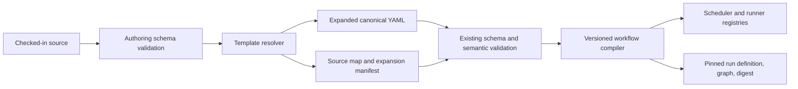

# Reusable Workflow Templates for Sibling Gaggles

> Status: **proposal — in review** ([#3578](https://github.com/Agent-Clubhouse/Goobers/issues/3578))
> · Area: contracts, runner, workflows
> · Parent: [#3572](https://github.com/Agent-Clubhouse/Goobers/issues/3572)
>
> Companion requirements:
> [`config-as-code.md`](../requirements/config-as-code.md) (`CFG-Q3`);
> [`workflow.md`](../requirements/workflow.md) (`WF-003`, `WF-005`, `WF-016`)

| Document Metadata | Details |
|---|---|
| Author | brandiv |
| Status | In Review |
| Team / Owner | Goobers |
| Created / Last Updated | 2026-08-28 |

## 1. Executive Summary

This RFC adds deterministic reuse of workflow structure across gaggles without adding
runtime inheritance to the workflow DSL. Checked-in config sources may define a named
`WorkflowTemplate` and thin `Workflow` bindings. A new composition phase resolves
typed parameters and emits complete, ordinary workflow YAML before the existing
validation, compilation, reload, and execution pipeline.

The materialized instance remains self-contained: it contains no template references,
remote includes, expressions, or hidden merge state. The expanded workflow is schema
validated, semantically compiled, hashed, pinned into each run, and consumed
identically by local and Temporal runners. Invalid references, parameter values,
cycles, conflicts, ownership violations, or security-sensitive changes fail the
candidate snapshot before last-known-good state is replaced.

The initial feature targets sibling gaggles that share implementation flow but differ
in backlog, triggers/selectors, trust and approval policy, branch namespace, and run
controls. It deliberately excludes arbitrary overlays, nested templates, remote
imports, dynamic expressions, and runtime child-workflow calls.

## 2. Context and motivation

### 2.1 Current state

Each workflow belongs to exactly one gaggle and owns inline `tasks`, `gates`, and
`parallels` (`api/v1alpha1/workflow_types.go:538-619`). Sibling gaggles can share
skills and use gaggle-level defaults such as `ciCommand`, but structurally identical
workflow graphs must be copied.

Current source flow:

```text
checked-in source
  -> workflow-source snapshot
  -> JSON Schema + semantic validation
  -> typed ConfigSet
  -> versioned workflow compiler
  -> scheduler/runner registries
  -> pinned run definition + graph + digest
```

No native `extends`, `include`, `templateRef`, fragment, or generic preprocessor
exists. `CFG-Q3` and `WF-005` explicitly identify composition as desired but
unspecified (`docs/requirements/config-as-code.md`; `docs/requirements/workflow.md`).

### 2.2 Problem

For `dev-brandiv-personal` and `dev-brandiv-team`, the intended implementation process
is one logical flow. Only intake and policy differ. Copying the graph causes:

- structural drift between sibling workflows;
- repeated fixes to tasks, transitions, gates, parallel branches, and capabilities;
- review difficulty because policy differences are mixed with graph duplication;
- Tutor changes that can update one copy but miss another;
- no machine-checkable proof that the implementation flow is identical.

### 2.3 Architectural constraints

The design must preserve:

- one owning gaggle per materialized workflow (`WF-003`);
- fully declared, deterministic desired state (`WF-001`, `WF-002`);
- fail-closed validation and last-known-good reload (`CFG-023`);
- complete run pinning and resume integrity (`WF-016`);
- identical valid config content across local and cloud tiers (`CFG-022`);
- gaggle-scoped credentials, workspaces, branches, and Tutor authority;
- frozen DSL interpreter semantics and canonical workflow digests.

## 3. Goals and non-goals

### 3.1 Functional goals

- [ ] Define one reusable workflow structure and bind it to multiple gaggles.
- [ ] Parameterize only template-author-approved values with explicit types.
- [ ] Materialize complete, standalone ordinary `Workflow` YAML.
- [ ] Preserve file/line provenance through composition and downstream validation.
- [ ] Produce deterministic expansion and workflow digests.
- [ ] Reject cycles, duplicate identities, conflicting targets, missing arguments,
      undeclared arguments, invalid values, and cross-boundary references.
- [ ] Preserve all-or-nothing reload and last-known-good behavior.
- [ ] Expose composition through schema, validate/lint, materialize, show, diff,
      scaffold, format, and generated CLI documentation.
- [ ] Support the same source and expanded output at local and cloud tiers.

### 3.2 Non-goals

- [ ] Runtime workflow inheritance or dynamic dispatch.
- [ ] Child workflows or stage calls.
- [ ] Remote URL/Git imports from outside the resolved workflow-source snapshot.
- [ ] Generic YAML merge keys, arbitrary JSON Patch, strategic merge, or overlays.
- [ ] Loops, conditionals, computed keys, environment-variable expansion, or secret
      interpolation.
- [ ] Cross-gaggle execution or cross-gaggle goober references.
- [ ] Parameterizing `dslVersion`, task/gate names, transitions, capabilities, stage
      kinds, scripts, commands, or workspace mode in the first release.
- [ ] Automatic migration of hand-authored duplicates without review.

## 4. Proposed solution

### 4.1 Architectural pattern

Adopt **compile-time configuration composition**:



The template resolver is a pure function:

```text
Expand(snapshot bytes, composition version)
  -> expanded files, source map, expansion manifest
```

It performs no network access, reads no environment variables, and has no clock or
filesystem inputs beyond the already-resolved source snapshot.

### 4.2 Persisted object model

Add one authoring-only kind:

```yaml
apiVersion: goobers.dev/v1alpha1
kind: WorkflowTemplate
compositionVersion: "1.0"
metadata:
  name: standard-implementation
spec:
  dslVersion: "2.0"
  parameters:
    - name: gaggle
      type: string
      target: /gaggle
      required: true
    - name: triggers
      type: trigger-list
      target: /triggers
      required: true
    - name: readiness
      type: readiness
      target: /readiness
      default: {}
    - name: runControls
      type: run-controls
      target: /runControls
      default: {}
    - name: approvers
      type: string-list
      target: /gates/0/human/approvers
      required: true
  workflow:
    gaggle: __parameter__
    triggers: __parameter__
    readiness: __parameter__
    runControls: __parameter__
    start: gather-context
    tasks: [...]
    gates: [...]
    parallels: [...]
```

A templated workflow remains `kind: Workflow`, but its source representation uses a
closed binding shape rather than executable `spec`:

```yaml
apiVersion: goobers.dev/v1alpha1
kind: Workflow
compositionVersion: "1.0"
metadata:
  name: implementation
dslVersion: "2.0"
template:
  name: standard-implementation
  arguments:
    gaggle: dev-brandiv-personal
    triggers: [...]
    readiness: {...}
    runControls: {...}
    approvers: [brandiv]
```

Rules:

1. A source `Workflow` declares exactly one of `spec` or `template`.
2. `dslVersion` on the binding must equal the template's `spec.dslVersion`; it is
   repeated to make release compatibility visible without expansion. Mismatch is an
   error. A future composition version may remove this duplication only through an
   explicit migration.
3. A `WorkflowTemplate` is not selected by `Manifest`, not returned by runtime APIs,
   not registered with a scheduler, and not independently executable.
4. Template names are unique within one resolved config snapshot.
5. References are snapshot-local names, never paths or URLs.
6. Nested `template` references are forbidden in composition version 1.0; therefore
   cycles are structurally impossible. The resolver still maintains a visitation
   stack and reports `CMP006` if future syntax or malformed input creates a cycle.

### 4.3 Parameter and override semantics

Parameters replace whole YAML nodes at exact RFC 6901 JSON Pointer targets.

Supported types in composition version 1.0:

| Type | Accepted node |
|---|---|
| `string` | YAML string |
| `integer` | YAML integer |
| `boolean` | YAML boolean |
| `string-list` | sequence of strings |
| `trigger-list` | value valid against the existing trigger-list schema |
| `readiness` | value valid against `ReadinessConditions` |
| `run-controls` | value valid against `RunControls` |
| `human-approvers` | sequence valid for the existing human-gate approver field |
| `task-input-map` | scalar-valued map valid for task inputs |

Semantics:

- Only targets declared by the template author can vary.
- A target is an exact node replacement; no string interpolation is performed.
- Every target must exist in the template workflow and contain the reserved scalar
  `__parameter__` or an explicit default-compatible node.
- Two parameters may not target the same node or ancestor/descendant nodes.
- Arguments are name-addressed and order-independent.
- Missing required arguments and unknown arguments are errors.
- Defaults are deep-copied before replacement.
- Lists replace lists; maps replace maps. Nothing merges implicitly.
- The resolver deep-copies the template for every binding.
- `metadata.name` comes from the binding and cannot be parameterized.
- `spec.gaggle` must be a required parameter and is validated normally after
  expansion.
- Security-sensitive paths are forbidden targets in 1.0:
  `/tasks/*/capabilities`, `/tasks/*/run`, `/tasks/*/workspace`,
  `/tasks/*/next`, `/gates/*/branches`, `/gates/*/next`,
  `/parallels`, `/start`, `/requires`, and `/tutorScope`.

The allowlist is conservative. New parameter types or target classes require a
composition-version feature entry and conformance tests.

### 4.4 Worked sibling-gaggle example

#### Shared template

```yaml
apiVersion: goobers.dev/v1alpha1
kind: WorkflowTemplate
compositionVersion: "1.0"
metadata:
  name: standard-implementation
spec:
  dslVersion: "2.0"
  parameters:
    - {name: gaggle, type: string, target: /gaggle, required: true}
    - {name: triggers, type: trigger-list, target: /triggers, required: true}
    - {name: readiness, type: readiness, target: /readiness, required: true}
    - {name: runControls, type: run-controls, target: /runControls, required: true}
    - {name: approvers, type: human-approvers, target: /gates/0/human/approvers, required: true}
    - {name: backlogInputs, type: task-input-map, target: /tasks/0/inputs, required: true}
  workflow:
    gaggle: __parameter__
    triggers: __parameter__
    readiness: __parameter__
    runControls: __parameter__
    start: gather-context
    tasks:
      - name: gather-context
        run:
          command: [goobers, gather-implement-context]
        inputs: __parameter__
        next: implement
      - name: implement
        goober: implementer
        capabilities: [contents:read, contents:write]
        next: review
      - name: local-ci
        run:
          command: [make, ci]
        next: approval
    gates:
      - name: approval
        human:
          approvers: __parameter__
        branches:
          pass: ""
          fail: "@escalate"
      - name: review
        goober: reviewer
        branches:
          pass: local-ci
          needs-changes: implement
          fail: "@escalate"
```

#### Personal binding and gaggle policy

```yaml
apiVersion: goobers.dev/v1alpha1
kind: Workflow
compositionVersion: "1.0"
metadata:
  name: implementation
dslVersion: "2.0"
template:
  name: standard-implementation
  arguments:
    gaggle: dev-brandiv-personal
    triggers:
      - type: backlog-item
        selector: {goobers:personal: ""}
        trustLabel: goobers:personal-approved
    readiness:
      maxConcurrentRuns: 1
      maxRunsPerHour: 2
    runControls:
      maxRepasses: 2
    approvers: [brandiv]
    backlogInputs:
      requireLabels: goobers:personal
      excludeLabels: goobers:team
---
apiVersion: goobers.dev/v1alpha1
kind: Gaggle
metadata:
  name: dev-brandiv-personal
spec:
  project: {provider: github, owner: gim-home, name: dev-brandiv}
  backlog:
    provider: github
    owner: gim-home
    name: brandiv.goobers
  isolation: {namespace: goobers-dev-brandiv-personal}
  branchNamespace: goobers-personal/
  requireLabels: [goobers:personal]
  runControls: {maxRepasses: 2}
```

#### Team binding and gaggle policy

```yaml
apiVersion: goobers.dev/v1alpha1
kind: Workflow
compositionVersion: "1.0"
metadata:
  name: implementation
dslVersion: "2.0"
template:
  name: standard-implementation
  arguments:
    gaggle: dev-brandiv-team
    triggers:
      - type: backlog-item
        selector: {goobers:ready: ""}
        trustLabel: goobers:approved
    readiness:
      maxConcurrentRuns: 4
      maxRunsPerHour: 12
    runControls:
      maxRepasses: 1
    approvers: [dev-brandiv-maintainers]
    backlogInputs:
      requireLabels: goobers:ready
      excludeLabels: goobers:personal
---
apiVersion: goobers.dev/v1alpha1
kind: Gaggle
metadata:
  name: dev-brandiv-team
spec:
  project: {provider: github, owner: gim-home, name: dev-brandiv}
  backlog:
    provider: github
    owner: gim-home
    name: dev-brandiv
  isolation: {namespace: goobers-dev-brandiv-team}
  branchNamespace: goobers-team/
  requireLabels: [goobers:ready]
  runControls: {maxRepasses: 1}
```

#### Materialized output

The running instance contains neither `WorkflowTemplate` nor `template:`. It contains
two standalone workflow objects:

```yaml
apiVersion: goobers.dev/v1alpha1
kind: Workflow
dslVersion: "2.0"
metadata:
  name: implementation
  annotations:
    goobers.dev/composition-digest: sha256:<digest>
    goobers.dev/template: standard-implementation
spec:
  gaggle: dev-brandiv-personal
  triggers:
    - type: backlog-item
      selector:
        goobers:personal: ""
      trustLabel: goobers:personal-approved
  readiness:
    maxConcurrentRuns: 1
    maxRunsPerHour: 2
  runControls:
    maxRepasses: 2
  start: gather-context
  tasks:
    - name: gather-context
      run:
        command: [goobers, gather-implement-context]
      inputs:
        requireLabels: goobers:personal
        excludeLabels: goobers:team
      next: implement
    - name: implement
      goober: implementer
      capabilities: [contents:read, contents:write]
      next: review
    - name: local-ci
      run:
        command: [make, ci]
      next: approval
  gates:
    - name: approval
      human:
        approvers: [brandiv]
      branches:
        pass: ""
        fail: "@escalate"
    - name: review
      goober: reviewer
      branches:
        pass: local-ci
        needs-changes: implement
        fail: "@escalate"
---
apiVersion: goobers.dev/v1alpha1
kind: Workflow
dslVersion: "2.0"
metadata:
  name: implementation
  annotations:
    goobers.dev/composition-digest: sha256:<digest>
    goobers.dev/template: standard-implementation
spec:
  gaggle: dev-brandiv-team
  triggers:
    - type: backlog-item
      selector:
        goobers:ready: ""
      trustLabel: goobers:approved
  readiness:
    maxConcurrentRuns: 4
    maxRunsPerHour: 12
  runControls:
    maxRepasses: 1
  start: gather-context
  tasks:
    - name: gather-context
      run:
        command: [goobers, gather-implement-context]
      inputs:
        requireLabels: goobers:ready
        excludeLabels: goobers:personal
      next: implement
    - name: implement
      goober: implementer
      capabilities: [contents:read, contents:write]
      next: review
    - name: local-ci
      run:
        command: [make, ci]
      next: approval
  gates:
    - name: approval
      human:
        approvers: [dev-brandiv-maintainers]
      branches:
        pass: ""
        fail: "@escalate"
    - name: review
      goober: reviewer
      branches:
        pass: local-ci
        needs-changes: implement
        fail: "@escalate"
```

The team result has the same task/gate graph bytes after policy slots are excluded,
but carries its own gaggle, backlog filters, trust label, approval list, readiness,
run controls, and composition digest. Gaggle-owned branch namespaces remain in each
`Gaggle`, preserving the existing runtime resolution seam.

## 5. Detailed design

### 5.1 Pipeline and validation order

The source-loading pipeline becomes:

1. Resolve the local or Git source to an immutable snapshot directory.
2. Discover YAML documents and record file/document offsets.
3. Validate ordinary objects with existing schemas and composition objects with
   authoring schemas.
4. Build a template index and binding index.
5. Validate template identities, composition versions, parameter declarations,
   target allowlist, target existence, target overlap, argument names, types, and
   required/default rules.
6. Resolve every binding independently into a complete YAML node tree.
7. Attach source-map entries and compute the composition digest.
8. Serialize expanded objects canonically into a staging directory.
9. Run the unchanged ordinary desired-state validation over the staging directory.
10. Decode `ConfigSet`, apply existing gaggle defaults, and compile workflows.
11. Atomically install/swap only when the entire snapshot succeeds.

Startup, `validate`, `lint`, `config materialize`, `config diff`, Git reconciliation,
and `apply` must call the same composition pipeline. There must not be a CLI-only
resolver or a separate cloud resolver.

### 5.2 Diagnostics and source locations

Add stable codes:

| Code | Meaning |
|---|---|
| `CMP001` | unknown template |
| `CMP002` | duplicate template identity |
| `CMP003` | unknown/duplicate argument |
| `CMP004` | missing required argument |
| `CMP005` | argument type/schema mismatch |
| `CMP006` | template cycle or nested reference |
| `CMP007` | forbidden/invalid target |
| `CMP008` | overlapping parameter targets |
| `CMP009` | DSL-version mismatch |
| `CMP010` | expanded workflow failed ordinary validation |
| `CMP011` | duplicate expanded workflow identity |
| `CMP012` | template/binding violates ownership or Tutor boundary |
| `CMP020` | deprecated composition version |
| `CMP030` | unsupported composition version |

Each issue carries:

- primary source: binding or template file, document index, line, column;
- related source: the other side of the reference;
- template name, workflow name, gaggle, parameter, and JSON Pointer where applicable;
- expanded-path location for downstream schema/semantic errors;
- a deterministic expansion stack.

For `CMP010`, the primary diagnostic should point to the argument when the generated
node came from a binding, otherwise to the template node. The expanded location is
included as related information. Existing `--json` and GitHub annotation formats gain
optional `relatedLocations`; text output prints one primary line and indented
provenance.

### 5.3 Canonicalization and digests

Define two distinct digests:

1. **Composition digest**: SHA-256 of canonical JSON containing
   `compositionVersion`, canonical template object, binding identity and arguments,
   and resolver version. Maps are key-sorted; YAML comments, anchors, formatting,
   filenames, and document order do not affect it.
2. **Workflow digest**: unchanged `workflow.ComputeDigest` over the complete expanded
   `workflow.Definition`.

The composition digest provides authoring provenance. The workflow digest remains the
runtime identity and WF-016 pin. A formatting-only source change leaves both stable;
an argument or template semantic change changes both as appropriate.

Materialization writes an adjacent machine-readable manifest:

```json
{
  "schema": "goobers.dev/composition-manifest/v1",
  "sourceDigest": "sha256:...",
  "outputs": [{
    "gaggle": "dev-brandiv-personal",
    "workflow": "implementation",
    "template": "standard-implementation",
    "compositionDigest": "sha256:...",
    "workflowDigest": "sha256:...",
    "sourceMap": "composition/dev-brandiv-personal__implementation.map.json"
  }]
}
```

The manifest is provenance metadata, not a compiler input. The materialized workflow
alone must remain sufficient to validate, compile, and resume.

### 5.4 Reload and last-known-good

Composition occurs inside candidate-snapshot construction. Any `CMP*`, schema,
semantic, provider, skill, or compiler error rejects the complete candidate. The
running registries and `appliedDigest` remain unchanged, and the instance journal
records `config.reload.rejected` with old source digest, candidate source digest, and
the first bounded set of diagnostics.

The config directory digest must cover:

- template documents;
- workflow bindings;
- all ordinary config documents;
- referenced goober instructions and skills;
- composition version and resolver semantic version.

The stability recheck remains immediately before registry replacement. A source
change during expansion discards the attempt and retries from a fresh snapshot.

### 5.5 Gaggle isolation and credentials

- A template is inert and owns no gaggle, runner, provider, token, workspace, or
  branch namespace.
- Every expanded workflow must have one concrete `spec.gaggle`.
- Existing same-gaggle goober and Tutor-target validation runs after expansion.
- Parameter targets cannot change capability lists, executor commands, transitions,
  workspaces, provider requirements, or Tutor scope in composition 1.0.
- Expansion requires no credentials and no network access.
- Remote templates are forbidden. Git-backed source resolution remains the only
  network boundary and continues to use `configrepo:read`.
- Gaggle branch namespace and credential grants continue to resolve from the
  materialized `Gaggle`, not the template.

### 5.6 Tutor write scope

Template source files have explicit ownership metadata:

```yaml
metadata:
  name: standard-implementation
  annotations:
    goobers.dev/template-owners: dev-brandiv-personal,dev-brandiv-team
    goobers.dev/tutor-write-policy: human-only
```

Composition version 1.0 supports:

- `human-only`: no Tutor may modify the template;
- `single-gaggle:<name>`: only that gaggle's per-gaggle Tutor may propose changes;
- `shared-review`: a Tutor may propose only if its action root includes the template
  and the resulting PR requires all listed owners' review.

Default is `human-only`. Existing path confinement remains authoritative and runs
before PR creation. Expansion does not grant write permission. A per-workflow Tutor
may edit its own binding arguments if the binding is within its configured root, but
not the shared template.

### 5.7 Versioning and compatibility

Composition is an authoring-language axis separate from `dslVersion`.

- `compositionVersion: "1.0"` appears on templates and templated workflows.
- The binary exposes a composition support matrix through `goobers versions`.
- Lifecycle levels mirror DSL versions: preview, supported, deprecated, unsupported.
- Resolver semantics for a released composition version are frozen.
- Additive parameter types or diagnostics may be feature-gated; changed expansion
  semantics require a new composition version.
- Ordinary, non-templated workflows remain valid without `compositionVersion`.
- Materialized workflows do not carry `compositionVersion` as executable semantics;
  they carry provenance annotations only.
- `goobers fix` may later migrate composition versions, but never auto-migrates on
  load.

No workflow DSL bump is required because the compiler receives the same ordinary
`WorkflowSpec`. The feature registry should nevertheless record
`config.workflow-template` as a composition feature and release notes must describe
the minimum binary needed to materialize it.

### 5.8 CLI, schema, scaffold, format, and lint

Required surfaces:

| Surface | Change |
|---|---|
| `goobers schema` | Add `workflow-template` and `workflow-binding` authoring schemas; distinguish source schemas from runtime schemas |
| `goobers validate` / `lint` | Run composition and emit `CMP*` diagnostics with related locations |
| `goobers config materialize` | Expand templates, write ordinary workflows plus composition manifest/source maps, then atomically swap |
| `goobers config show` | Default to effective expanded workflows; add `--source` for binding/template view and `--provenance` |
| `goobers config diff` | Compare expanded effective workflows; optionally explain which template/argument caused each difference |
| `goobers workflow show` | Show expanded DAG and template provenance |
| `goobers scaffold workflow-template` | Create a closed starter template |
| `goobers scaffold workflow --template <name>` | Create a binding with required arguments |
| `goobers format` | New command or formatter mode that canonicalizes authoring YAML without expansion |
| `goobers versions` / `features` | Report composition-version support and feature lifecycle |

Generated `docs/cli`, all affected manpages, and Bash/Fish/Zsh completions must be
regenerated from the command registry. Hand-authored guides must be updated separately:
quickstart, arbitrary-repo onboarding, config drift, config PR validation, DSL
authoring, instance placement, releases, and Tutor write boundary.

### 5.9 Source layout

Recommended source layout:

```text
manifest.yaml
templates/
  workflows/
    standard-implementation.yaml
gaggles/
  dev-brandiv-personal/
    gaggle.yaml
    goobers/
    workflows/
      implementation.yaml
  dev-brandiv-team/
    gaggle.yaml
    goobers/
    workflows/
      implementation.yaml
skills/
```

Materialized runtime layout remains:

```text
config/
  manifest.yaml
  gaggles/
    dev-brandiv-personal/workflows/implementation.yaml
    dev-brandiv-team/workflows/implementation.yaml
  composition/
    manifest.json
    *.map.json
```

`templates/` is source-only. The ordinary runtime loader continues skipping no hidden
composition state because materialization removes the source-only directory.

## 6. Alternatives considered

| Option | Benefits | Rejection reason |
|---|---|---|
| Persist inheritance in executable `WorkflowSpec` | Minimal materialization distinction | Compilers and runners must resolve mutable bases; digest/pinning semantics become composite; cross-tier implementations can diverge |
| Generic YAML anchors/includes | Familiar syntax | Weak typing, unclear merge order, poor source mapping, path/network risk |
| Named task/gate fragments | Smaller units | Name collisions and partial-graph validity create a second graph linker; not needed for the sibling workflow use case |
| Arbitrary overlays/patches | Maximum flexibility | Allows indirect changes to security and transitions, is order-sensitive, and produces hard-to-review effective state |
| External generators | No product work | Cannot guarantee reviewability, reproducibility, diagnostics, Tutor behavior, or local/cloud parity |
| Full workflow templates before materialization | Complete output, closed runtime DSL, clean pinning | Selected |

## 7. Cross-cutting concerns

### 7.1 Security

- Resolver inputs are limited to the resolved source snapshot.
- Template names are identifiers, never filesystem paths.
- No network, environment, command execution, secrets, or token resolution occurs.
- Maximums: 256 templates, 256 bindings, 64 parameters per template, 1 MiB expanded
  workflow, and existing task/gate/parallel limits.
- Expansion depth is one in v1.0.
- Security-sensitive target paths are denied even when their value type is otherwise
  valid.
- Source-map and diagnostic text pass through existing redaction before journaling.

### 7.2 Observability

Emit:

- `config.composition.expanded` with source/candidate digest and counts;
- `config.composition.rejected` with bounded code counts;
- template name and composition digest as runner annotations on
  `config.reloaded`, not on stage invocation envelopes;
- counters for expansion successes, failures by code, and duration.

Do not place raw arguments in telemetry because task inputs may later contain
sensitive locators.

### 7.3 Determinism and performance

- Sort template and binding identities before expansion.
- Sort map keys during canonical digesting.
- Never depend on filesystem enumeration order.
- Cache expansion by source digest plus resolver version.
- Enforce bounded object and output sizes before allocation-heavy validation.
- Run all independent binding expansions in deterministic order; concurrency is
  optional but output ordering must remain stable.

## 8. Migration, rollout, and testing

### 8.1 Staged implementation

**Phase 1 - composition core**

- Add source ASTs, schemas, support matrix, pure resolver, source maps, canonical
  digests, and unit tests.
- Keep all CLI behavior unchanged behind a disabled preview feature.

**Phase 2 - validation and materialization**

- Integrate one pipeline into local-dir and Git sources.
- Add `CMP*` diagnostics, atomic staging, provenance manifest, and last-known-good
  tests.
- Add config-source-to-materialized golden fixtures.

**Phase 3 - authoring surfaces**

- Add schema, show, diff, workflow-show, scaffold, format, versions, and feature
  support.
- Regenerate generated CLI docs/manpages/completions and update guides.

**Phase 4 - cross-runner and Tutor hardening**

- Feed only expanded workflows to config-sync/operator.
- Add local/cloud conformance fixtures with identical workflow digests.
- Enforce template ownership and Tutor policy.

**Phase 5 - migration and graduation**

- Convert one duplicated reference-workflow pair to templates.
- Migrate `dev-brandiv-personal` and `dev-brandiv-team` with reviewed bindings.
- Compare pre/post expanded workflows and semantic digests.
- Graduate the feature only after shipped-config and rejection-path acceptance.

### 8.2 Migration strategy for sibling workflows

1. Choose one duplicate as the canonical graph.
2. Normalize semantically irrelevant YAML ordering.
3. Diff siblings and classify every difference as graph structure, gaggle policy, or
   accidental drift.
4. Fix accidental drift before templating.
5. Create a template from the canonical graph.
6. Expose only the approved policy differences as parameters.
7. Generate bindings for each gaggle.
8. Materialize and compare each expanded workflow to its original.
9. Require exact `workflow.ComputeDigest` equality when no behavior is intended to
   change; otherwise record and review the intentional digest change.
10. Commit source template/bindings and generated-output evidence together for the
    migration PR; runtime materialization remains instance state.

### 8.3 Test plan

**Unit tests**

- deterministic expansion independent of file/map order;
- all parameter types, defaults, missing/unknown arguments;
- forbidden, missing, overlapping, and ancestor/descendant targets;
- duplicate templates/workflows and nested/cyclic references;
- canonical composition digest sensitivity and formatting insensitivity;
- source-map projection for template and binding nodes;
- size/count limits and path/name validation.

**Schema and validation tests**

- authoring schemas reject unknown fields;
- expanded output passes ordinary workflow schema;
- downstream errors map back to the correct template or argument line;
- same-gaggle goober, Tutor target, capability, trigger, and parallel checks still
  fail with existing codes plus composition provenance.

**Integration tests**

- local-dir materialize, Git source sync, `apply`, and `--watch-config`;
- invalid template revision retains byte-identical active definitions;
- concurrent source change fails the stability recheck;
- config show/diff/workflow-show report effective state and provenance;
- scaffold/format round trip.

**Conformance tests**

- local and Temporal runners receive byte-equivalent expanded definitions and produce
  equal normative workflow version/digest events;
- materialized output validates unchanged through config-sync/operator;
- no resolver exists in either runner.

**Security tests**

- remote/path includes, traversal, anchors used as indirection, environment expansion,
  and command substitution are rejected;
- forbidden parameter targets cannot alter capabilities, commands, transitions,
  workspace, requirements, or Tutor scope;
- one gaggle cannot bind another gaggle's goober;
- a per-gaggle Tutor cannot modify a shared human-only template;
- config-repo credentials are the only credentials involved in source retrieval.

**Acceptance tests**

- personal/team example materializes two standalone workflows with identical shared
  graph structure and intended policy differences;
- changing one shared task changes both new workflow digests on the next accepted
  reload but not any in-flight run;
- changing only the personal binding does not change the team workflow digest;
- invalid team arguments reject the entire candidate and leave both active workflows
  on the last-known-good snapshot;
- deleting the template reports all dependent bindings with source locations.

## 9. Open questions / unresolved issues

These decisions do not block an implementation spike; the defaults below are the RFC
recommendation and should be confirmed before approval.

1. **Should bindings repeat `dslVersion`?** Recommended: yes in composition 1.0, with
   exact-match validation, because compatibility is visible before expansion.
2. **Should arbitrary task input maps be parameterizable?** Recommended: allow only
   scalar-valued `task-input-map` initially; add richer typed shapes when a concrete
   scenario requires them.
3. **Should generated workflows be committed beside source?** Recommended: no for
   normal operation; materialize them atomically into the instance and expose a
   deterministic `--output`/CI artifact for review.
4. **Should shared templates be Tutor-writable?** Recommended: default
   `human-only`; require explicit ownership metadata and multi-owner review for any
   shared-write mode.
5. **Should templates be instance-global or gaggle-scoped?** Recommended:
   instance-global names under `templates/workflows`, with bindings establishing
   gaggle ownership and strict no-runtime-cross-gaggle semantics.
6. **Should composition use the workflow DSL version axis?** Recommended: no; use a
   separate `compositionVersion` because expansion semantics and executable graph
   semantics evolve independently.
7. **Should v1.0 permit nested templates or reusable subgraphs?** Recommended: no.
   Start with complete workflow templates; revisit only after measured duplication
   remains inside templates.

## 10. Acceptance criteria

The feature is ready to graduate when:

- source templates and bindings are fully schema documented;
- one resolver is shared by validate, materialize, reload, apply, and cloud config
  sync;
- materialized runtime YAML has no unresolved composition constructs;
- all diagnostics retain useful source provenance;
- workflow digest and run-pinning behavior are unchanged;
- last-known-good survives every composition failure mode;
- local/cloud conformance passes on expanded fixtures;
- sibling-gaggle isolation and Tutor boundaries have negative tests;
- generated CLI documentation and hand-authored guides are current;
- the personal/team example passes the full acceptance suite.
